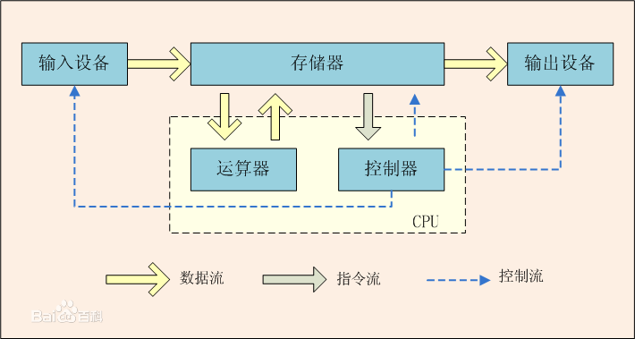

# 计算机系统概述
## 计算机发展简史  
略
### 冯洛依曼机（提出**存储程序**的思想）  
将事先编好的程序和原始数据送入主存中，然后启动执行。计算机能在不需操作人员干预下自动完成逐条取出质量和执行指令的任务。    
ENIAC 第一台计算机。  
### 冯·洛依曼结构：
- 存储器：存放数据、存放指令  
- 控制器：自动执行指令
- 运算器：进行算术、逻辑和附加运算
- 输入设备
- 输出设备

内部以二进制表示指令和数据，每条指令由操作码和地址码两部分组成。操作码指出操作类型，地址码指出操作数的地址，由一串指令组成程序。  

采用**存储程序**的方式在工作。  

IAS 计算机结构。  
## 计算机系统的组成
### 中央处理器
运算器：ALU, GPRS,标志寄存器等  
控制器：对指令译码生成控制信号  
### 存储器
存储阵列、地址译码器
### 外部设备和设备控制器

### 总线（数据传输）
MDR、MAR、控制线。  

## 计算机层次结构

