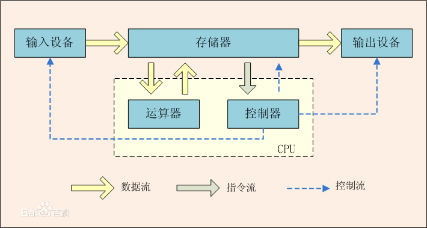

# 计算机系统概述
## 计算机发展简史  
略
### 冯洛依曼机（提出**存储程序**的思想）  
将事先编好的程序和原始数据送入主存中，然后启动执行。计算机能在不需操作人员干预下自动完成逐条取出质量和执行指令的任务。    
ENIAC 第一台计算机。  
### 冯·洛依曼结构：
- 存储器：存放数据、存放指令  
- 控制器：自动执行指令
- 运算器：进行算术、逻辑和附加运算
- 输入设备
- 输出设备

内部以二进制表示指令和数据，每条指令由操作码和地址码两部分组成。操作码指出操作类型，地址码指出操作数的地址，由一串指令组成程序。  

采用**存储程序**的方式在工作。  

IAS 计算机结构。  
## 计算机系统的组成
### 中央处理器
运算器：ALU, GPRS,标志寄存器等  
控制器：对指令译码生成控制信号  
### 存储器
存储阵列、地址译码器
### 外部设备和设备控制器

### 总线（数据传输）
MDR、MAR、控制线。  

## 计算机层次结构

## 存储器

## 运算器
- 算术/逻辑运算、比较、转移和测试等功能
- 根据运算的结果设置条件状态寄存器

## 系统
基于（共享）总线的系统互连  

基于专用通道结构（专用通道总线）的系统互连  

冯洛依曼结构，哈佛结构。  

cache 采用哈佛结构，主存采用冯洛依曼结构。  

机器语言： 0 , 1，汇编语言：用助记符表示机器指令啥的  

*好无聊，东扯西扯的不知道在讲什么*  

## 计算机运行程序的过程

预编译、汇编、链接  

操作系统、ISA 之类

## 计算机性能评价

### CPU 时间
吞吐率（单位时间内完成的工作量）和响应时间（也称执行时间或等待时间，指作业提交开始到作业完成所用的时间）是考量一个计算机系统性能的两个基本指标。  
用户感觉到的执行时间分成用户 CPU 时间和其他时间。用户 CPU 时间指真正用于用户程序代码的执行时间，其他时间包括 CPU 运行操作系统程序的时间以及等待 I/O 操作完成的时候或 CPU 用于其他用户程序的执行时间。  

计算机有两种不同的性能  
* 响应时间
* 执行时间
* 等待时间或时延

---
基本性能评价的标准是：CPU 的执行时间。  

在对用户 CPU 时间进行计算时需要用到：时钟周期、时钟频率和 CPI。  

已知上述参数，可以得到用户程序的 CPU 执行时间：  

$$
\begin{align*}
用户 CPU 时间 &= 程序总时钟周期数 \div 时钟频率\\
&= 程序总时钟周期数 \times 时钟周期\\
&= 程序总指令条数 \times CPI \times 时钟周期
\end{align*}
$$

用户 CPU 度量公式中的时钟周期、指令条数、CPI 三个因数是相互制约的，因此对于解决同一个问题的不同程序，即使是在同一台计算机上，指令条数最少的程序也不一定执行得最快。  

---
### 时钟周期数
上述公式中，程序总的时钟周期数可又由程序所含指令条数和相应的 CPI 求得。  

$$
程序总时钟周期数=程序总指令条数\times CPI
$$

如果已知程序中有 $n$ 总不同类型的治疗，第 i 种指令的条数和 CPI 分别是 $C_i$ 和 $CPI_i$ 则有：  

$$
程序总时钟周期数 = \sum_{i=1}^{n} (CPI \times C_i)  
$$

### 计算机性能
机器 X 的速度（性能）是Y的n倍：  
$$
\frac{ExTime(X)}{ExTime(Y)} = \frac{Performance(X)}{Performance(Y)} = n
$$

相对性能用执行时间的倒数来表示。  

比较计算机的性能时，用执行时间来衡量。  
计算机的信念可以看成用户 CPU 时间的倒数，因此两台计算机性能之比就是用户 CPU 时间之比的倒数：  

> 若计算机 M1 和 M2 的性能之比为 $n$ ，则说明计算机 M1 的速度是计算机 M2 性能的 $n$ 倍。也就是说：在计算机 M2 上执行程序的时间是在计算机 M1 上执行时间的 $n$ 倍。  

时间指标：  
(1) 主频f(Hz)/时钟周期T(秒)  
f 与 T 互为倒数。T 也成为节拍周期，是处理操作最基本的时间单位。  
CPU 主频越高，T周期时间就越短。  
### (2) CPI(Clock cycles Per Instruction)
执行一条指令（平均）需要的时钟周期数（即T周期的个数）  

$$
CPI = \frac{CPU 执行的总时钟周期数}{执行的总指令条数}
$$
用平均值。  
CPI = 程序所有指令的时钟周期数之和/程序中的指令总数  

程序的综合 CPI:  
$$
CPI = \sum(程序中的各类指令的 CPI \times 程序中该类指令的比例)
$$

---

> CPI 越小 CPU 速度越快吗？  
> 不一定：CPI 表示平均每条指令需要多时钟周期数，在指令数和时钟频率相同的情况下，CPI 越小，程序执行越快。  
> 程序的 CPU 执行时间为： $T_{CPU} = 指令数 \times CPI \times 时钟周期时间 = \frac{指令数 \times CPI}{时钟频率}$  
> 所以比较 CPU 速度时，还要考虑**指令数和时钟频率**，不同程序的 CPI 也可能不同。  

IPC：CPU 每一时钟周期内所执行的指令是多少。  

### MIPS(Million Instructions Per Second):  
每秒钟CPU执行的指令条数（以百万条为单位）  

$$
MIPS = \frac{指令条数}{执行时间 \times 10 ^6} = \frac{指令条数}{CPU时钟周期之和 \times 10^6 / f} = \frac{f}{CPI \times 10 ^ 6}
$$

峰值 MIPS: 选取一组指令组合，使得得到的平均 CPI 最小，由此得到的 MIPS 就是峰值 MIPS。    

MFLOPS:  
描述计算机每秒钟执行的浮点操作次数。  
世界最快的超算：2.198 ExaFLOPS    

CPU 执行时间：执行一段程序所需的时间    
(CPU时间 + I/O时间 + 存储访问时间+各类排队时延等)。  
考虑 CPU  

Amdahl 定律：  
对系统中某部分（硬件或软件）进行更新所带来的系统性能改进程度，取决于该部分被使用的频率或其执行时间占总执行时间的比例。  
$$
改进后执行时间=\frac{改进部分执行时间}{改进部分的改进倍数}+未改进部分执行时间  
$$

或  
$$
整体改进倍数=\frac{1}{改进部分时间比例/改进部分的改进倍数+未改进部分时间比例}
$$

$$
p = \frac{1}{\frac{t}{n}+1-t}
$$

## 公式表
$$
T_c = \frac{1}{f}
$$

$$
T_{CPU} = IC \times CPI \times T_c = \frac{IC \times CPI}{f}   
$$

> 执行时间 = 要执行多少指令×每条指令平均要几个周期÷每秒能跑多少个周期  
$$
CPI = \frac{T_{CPU} \times f}{IC}
$$

$$
总时钟周期 = IC \times CPI
$$

$$
CPI_{avg} = \frac{\sum IC_iCPI_i}{\sum IC_i}=\sum p_i CPI_i
$$

> 求 CPI 本质就是总共跑了多少周期÷总指令数  

$$
MIPS = \frac{IC}{T \times 10^6} = \frac{f}{CPI \times 10^6}
$$

$$
MIPS_{max} = \frac{f}{CPI_{min} \times 10^6}  
$$

> 

$$
Performance = \frac{1}{T}
$$

$$
\frac{P_A}{P_B} = \frac{T_B}{T_A}
$$

$$
CPU 占用率 = \frac{T_CPU}{T_{总}} \times 100\%
$$

$$
性价比 = \frac{1}{T \times Price}
$$

> 时间越短越好，价格越低越好。  

$$
T_{算术平均} = \frac{\sum T_i}{n}
$$

$$
T_{几何平均}=\sqrt[n]{\prod T_i}
$$

> 绝对时间：常见算术平均  
> 比值、归一化性能：常见几何平均  

优化替换指令：  
$$
\Delta T = \frac{N(CPI_{old} - CPI_{new})}{f}
$$

$$
N = \frac{f\Delta T}{CPI_{old} - CPI_{new}}
$$

核心是：  
$$
执行时间 = \frac{指令条数 \times CPI}{时钟频率}
$$

$$
\text{指令数}
\xrightarrow{\times CPI}
\text{总周期数}
\xrightarrow{\div f}
\text{执行时间}
$$

