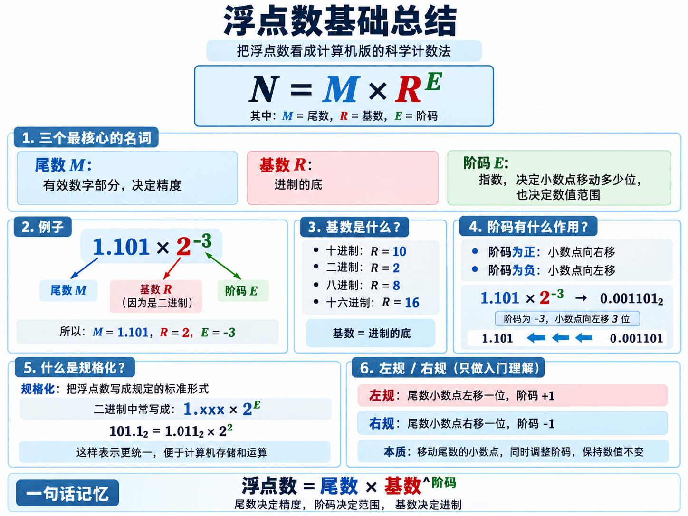
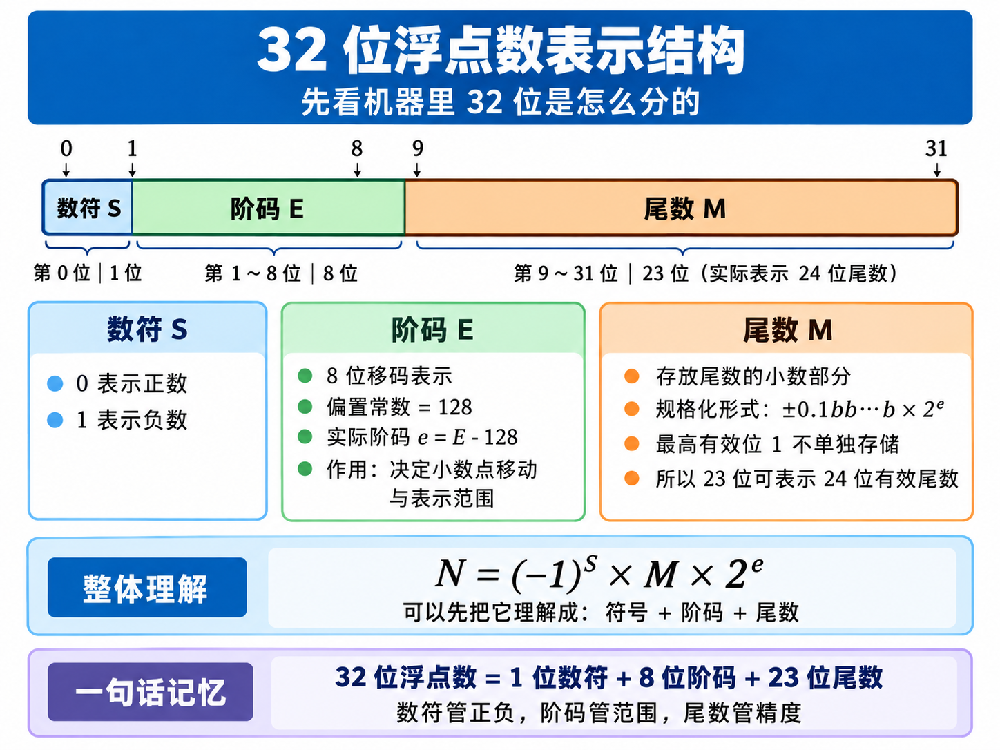
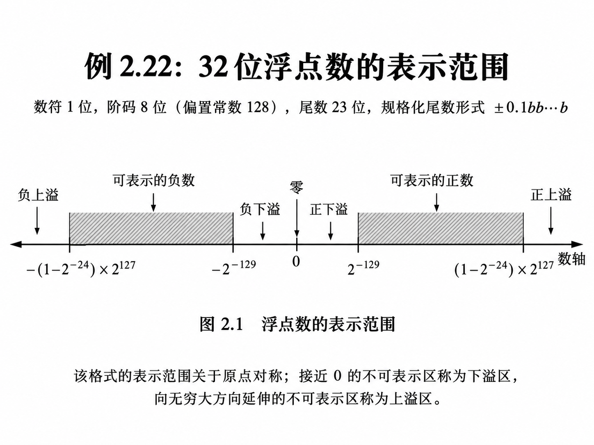
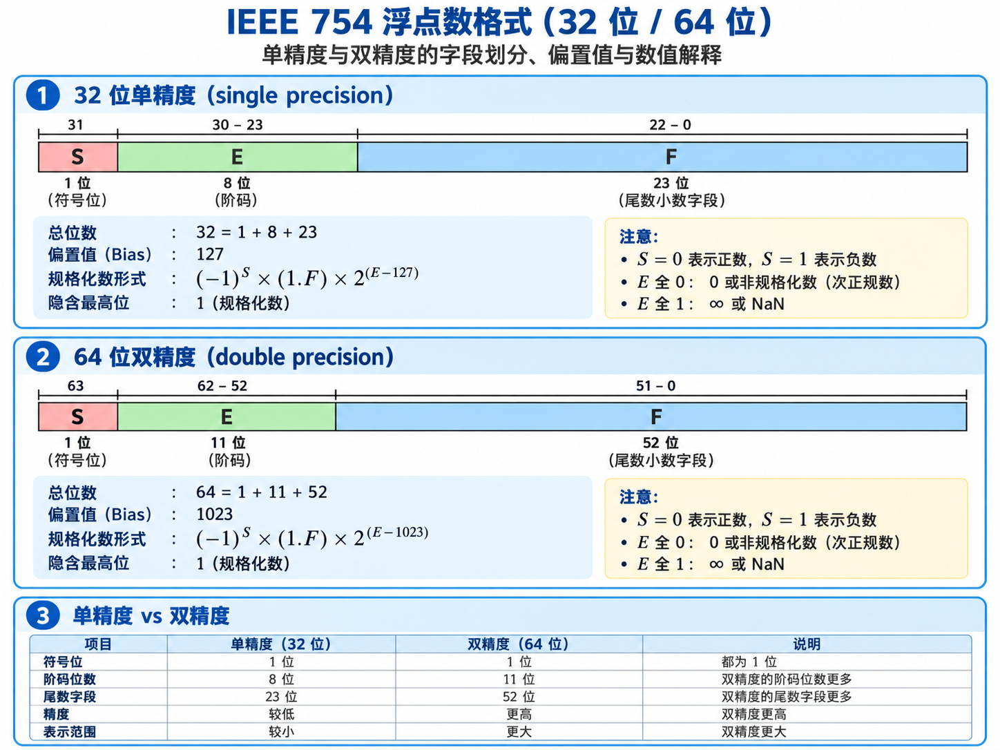

# 第二章 数据的机器级表示

## 数值数据的表示  

### 定点数表示

采用二进制的原因：

1. 物理器件容易表示两种稳定状态，例如高电平和低电平。
2. 二进制的运算规则简单，便于用逻辑门电路实现。
3. `0` 和 `1` 可以分别对应逻辑假和逻辑真，便于实现逻辑运算。

十进制数的按权展开：

$$
(5836.47)_{10}
=5\times10^3+8\times10^2+3\times10^1+6\times10^0
+4\times10^{-1}+7\times10^{-2}
$$

一个 $n$ 位无符号二进制数的十进制值，等于每一位乘以对应位权后再相加：  

$$
v = \sum^{n-1}_{i=0}2^i b_i
$$

用下标表表示数的基：  
$$
11001_2 = 25_{10}
$$

后缀： B 二进制，H 十六进制（前缀 `0x`，O 八进制。  

| 十进制 | 二进制 | 八进制 | 十六进制 |
|--------|--------|--------|----------|
| 0      | 00000  | 0      | 0x0      |
| 1      | 00001  | 1      | 0x1      |
| 2      | 00010  | 2      | 0x2      |
| 3      | 00011  | 3      | 0x3      |
| 4      | 00100  | 4      | 0x4      |
| 5      | 00101  | 5      | 0x5      |
| 6      | 00110  | 6      | 0x6      |
| 7      | 00111  | 7      | 0x7      |
| 8      | 01000  | 10     | 0x8      |
| 9      | 01001  | 11     | 0x9      |
| 10     | 01010  | 12     | 0xA      |
| 11     | 01011  | 13     | 0xB      |
| 12     | 01100  | 14     | 0xC      |
| 13     | 01101  | 15     | 0xD      |
| 14     | 01110  | 16     | 0xE      |
| 15     | 01111  | 17     | 0xF      |
| 16     | 10000  | 20     | 0x10     |


$2^3=8$，$2^4=16$  

### 进制数的相互转换
八进制或十六进制转换成二进制：**逐位替换**  

八进制例子：

$$
(57.3)_8=(101\ 111.011)_2
$$

十六进制例子：

$$
(2F.A)_{16}=(0010\ 1111.1010)_2
$$

二进制数转换成八进制：每 3 位一组。  
分组规则：整数部分从小数点向左分组，不足时在左侧补 `0`；小数部分从小数点向右分组，不足时在右侧补 `0`。  

$$
(110101.01)_2=(110\ 101.010)_2=(65.2)_8
$$

二进制数转换成十六进制：每 4 位一组。  

$$
(110101.01)_2=(0011\ 0101.0100)_2=(35.4)_{16}
$$

R 进制数转换成十进制数：**按权展开**。  
把每一位乘以对应的 $R$ 的幂，再相加。

例如：

$$
(10101.01)_2=1\times2^4+1\times2^2+1\times2^0+1\times2^{-2}=21.25
$$

十进制数转换成 $R$ 进制数时，要把整数部分和小数部分分开处理。  

整数部分：**除基取余，上低下高**。每次得到的余数依次是低位到高位，因此要倒序读取。  
例如，十进制整数转二进制时直接除以 2；转八进制时除以 8。

十进制整数转二进制还可以用 2 的幂快速拆分：

```text
835 - 512 = 323
323 - 256 = 67
67 - 64 = 3
3 - 2 = 1
1 - 1 = 0
```

所以：

$$
835=2^9+2^8+2^6+2^1+2^0=(1101000011)_2
$$

小数部分：**乘基取整，上高下低**。每次取乘积的整数部分，按得到的先后顺序读取；当小数部分不再为 0 或达到要求位数时停止。

例如：

$$
0.6875_{10}=0.1011_2=0.54_8
$$

如果乘积的小数部分始终得不到 0，得到的就是截取后的近似值。

十进制转二进制：整数部分**除2取余**，小数部分**乘2取整**。  
也就是小数部分乘 2 之后在 $1 < x < 2$ 取 1 在 $0 < x < 1$ 取 0。  

#### 进位计数制
原码、补码、反码、移码表示。  
##### 原码  
原码也称“符号-数值”表示法，由 1 位符号位和数值位组成：  
- 符号位为 `0` 表示正数，符号位为 `1` 表示负数；  
- 数值位直接表示真值的绝对值；  
- 正数和负数只有符号位不同，数值位完全相同；  
- `+0` 和 `-0` 有两种不同的表示。  

缺点：
0 的表示不唯一，故不利于编程。  
加减运算方式不统一。  
需要额外对符号位进行处理，不利于硬件设计。  
如果 $a<b$，实现 $a-b$ 比较困难。  

计算机内部编码表示后的数称为机器数。  
真值：机器数真正的值（即现实中带有正负号的数）  

8 位时：  
`0000 0000` ~ `0111 1111`：$+0$ ~ $+127$。  
`1000 0000` ~ `1111 1111`：$-0$ ~ $-127$。  

`0000 0000`：$+0$；`1000 0000`：$-0$。  
`0111 1111`：$2^7-1=127$；`1111 1111`：$-(2^7-1)=-127$。  

##### 补码
在一个模运算系统中，一个数与它除以模后的余数等价。  

时钟是一种模 12 系统：$13 \mod 12 = 1$ 即 13 点等于 1 点。  
-4 模 12 补码等于 8。  
同样有 $-3=9(\mod 12)$；$-5 = 7(\mod 12)$  

取符号位前一位的数，比如 8 位：$2^{7+1}=256$，所以 8 位补码的模为 $256$，应取 $\mod 256$。  

结论：  
1. 一个负数的补码等于模减该负数的绝对值。  
2. 对于某一确定的模，数 x 减去小于模的数y,总可以用数 x 加上 -y 的补码来代替。  

$$
[x]_{补} = M + x \pmod{M}
$$

有: 
$$
-3 \equiv 9 \pmod{12}
$$

$$
[-1]_{补} = 2^n - 1 (n 个 1)
$$

计算机减法运算：  

$$
A-B=A+[-B]_{\text{补}}
$$

减一个数=加上这个数的补码数  

一个负数的补码等于对应正数补码的“各位取反，末位加一”。  

假定补码有 n 位，则：  
定点整数: $[x]_{补}=2^n + X (-2^n \le X < 2^n, mod 2^n)$  
定点小数： $[x]_{补}=2 + X (-1 \le X < 1, mod 2)$ (实际不是用补码表示定点小数)  

补码与真值自建的简便转换：  
快书得到 123 的二进制表示：123 = 127 - 4 = 01111111b - 100b = 01111011b  

##### 移码
将每个数值加上一个偏置常数。只有整数才有移码。    
不要直接表示负数，而是给所有数统一加一个偏置，让整个数轴向右平移。  
实际用途：**让有符号数的大小关系和无符号数大小关系一致。**用来表示浮点数阶码。    
$$
[x]_{\text{移}}=x+2^{n-1}
$$
 其中 n 是编码位数。例如 8 位移码的偏移量为 128：  
- -128→00000000
- 0→10000000
- +127→11111111

同一位数下，移码等于补码的最高符号位取反。  

#### 教材结合补充：先把补码真正看懂

教材第 2 章强调：补码的位数必须明确。8 位补码的模是 $2^8=256$；上面的钟表例子使用模 12，只是为了帮助理解模运算，不能把 12 直接带入 8 位补码。

对于 $n$ 位补码，取值范围为

$$
-2^{n-1}\le x\le 2^{n-1}-1
$$

例如 8 位补码的范围是 -128 到 127：

```text
00000000 = 0
01111111 = 127
10000000 = -128
11111111 = -1
```

负数补码可以用“绝对值按位取反，末位加 1”快速求出。例如：

```text
+10：00001010
取反：11110101
加 1：11110110 = 0xF6，即 -10 的 8 位补码
```

补码能让减法转化为加法。例如 8 位计算 $5-3$：

```text
  00000101       5
+ 11111101      -3
------------
1 00000010       2
```

最高位进位被舍弃，保留低 8 位。需要注意，两个同号数相加后符号改变时发生有符号溢出，例如 `01111111 + 00000001` 得到 `10000000`，但数学结果 $128$ 已超出 8 位补码范围。

补码扩展位数时要进行符号扩展：正数高位补 `0`，负数高位补 `1`。例如：

```text
8 位： 11110110 = -10
16 位：11111111 11110110 = -10
```

#### 定点整数的表示
无符号整数、带符号整数。  

带符号整数：用补码运算  
补码运算系统是模运算系统，加、减运算统一。  

带符号整数和无符号数的比较：  
扩充操作有差别：  
MIPS 两种加载指令。  
数的比较有差异：  
### 浮点数格式和表示范围

### 浮点数的规格化

### IEEE754 浮点数标准

### C 程序中的整数类型、浮点数类型

### 十进制数表示


### 例题
#### 移码转换

若某数的移码为 $10000001$ 则该数真值是多少？
A. -1  
B. +1  
C. -128  
D. +127  

答案：B  
移码与补码的关系是符号相反。移码 10000001 对应的补码是 00000001 即 +1。  
或者说，移码的定义是真值加偏移量，1+128=129=10000001  

#### 补码转换原码
在 8 位二进制系统中，若某负数的补码为 $11110001$  则该数对应的原码是？  

A. 10001111  
B. 10001110  
C. 11110001  
D. 10000001  

答案：A  

> **负数补码 → 原码：先对补码“取反 + 1”，得到绝对值的二进制，再把最高位改成 1 表示负数。**  

补码为 $11110001$ 最高位是 1，说明是负数。先全部按位取反： $00001110$ 第二步：加 1： $00001110 + 1 = 00001111$ 所以这个数的绝对值是 15，即原来的数是 -15。第三步写成原码： $10001111$   


#### 补码转换原码

已知某 8 位二进制数的补码为 $11010110$ 则该数对应的原码是？

A. 10101010  
B. 10101001  
C. 11010110  
D. 10101011  

答案：A  


最高位仍是 1，说明是负数。第一步取反：$00101001$，第二步：加 1： $00101001 + 1 = 00101010$ ，所以绝对值是 $00101010_2 = 42_{10}$ ，所以数是 -42。最后写原码 $10101010$ 。  

$$
\boxed{
\text{负数补码}
\xrightarrow{\text{按位取反}}
\xrightarrow{+1}
\text{绝对值}
\xrightarrow{\text{最高位置 }1}
\text{原码}
}
$$


## 整数的表示
### 无符号整数
一个编码的所有二进制位都用来表示数值而没有符号位时，该编码表示的就是无符号整数。无符号整数都是正整数或非负整数。    

无符号整数省略了一位符号位，所以在字长相同的情况下，能表示比有符号整数更大的数。    
n 位无符号整数可表示的数的范围是 $0 ~ (2^n - 1)$ 。  
比如： 8 位无符号整数最大数为 255，而有符号整数为 127。  
### 带符号整数
必须用一个二进制位来表示符号，用补码来进行编码。  
n 位带符号整数可表示的范围为 $-2^{n-1} ~ (2^{n-1} - 1)$ 。  
比叡 8 位带符号整数的表示范围为 $-128 ～ +127$ 。  

### C 语言的整数类型
无符号整数在 C 语言中对应 `unsigned short`, `unsigned int`(`unsigned`), `unsigned long`。可以在数的后面加一个 `u` 或 `U` 来表示无符号整数比如：12345U, 0x2B3Cu 。   

如果执行一个运算时同时有无符号整数和带符号整数参加，C 编译器会隐含地将带符号整数强制类型转换为无符号整数。  

### C 语言整数类型的保证取值范围

下表列出 C 标准要求实现至少支持的取值范围。具体实现可以提供更大的范围，不能仅凭类型名称假定它在所有平台上的位数都相同。

| 类型 | 标准至少保证的取值范围 |
|------|------------------------|
| `_Bool` | 0～1 |
| `char` | 若按无符号类型实现：0～255；若按有符号类型实现：-127～127（具体符号性由实现决定） |
| `signed char` | -127～127 |
| `unsigned char` | 0～255 |
| `short` / `signed short` | -32767～32767 |
| `unsigned short` | 0～65535 |
| `int` / `signed int` | -32767～32767 |
| `unsigned int` | 0～65535 |
| `long` / `signed long` | -2147483647～2147483647 |
| `unsigned long` | 0～4294967295 |
| `long long` / `signed long long` | -9223372036854775807～9223372036854775807 |
| `unsigned long long` | 0～18446744073709551615 |

表中是标准保证的下限，不一定是当前机器上的实际范围；实际上下界可通过 `<limits.h>` 中对应的宏查询，例如 `INT_MIN`、`INT_MAX` 和 `UINT_MAX`。

## 实数的表示
### 浮点数的表示
对于任意实数 $X$ 可以表示为：  

$$
X = (-1)^S \times M \times R^E
$$

其中:
- S 取 0 或 1 用来决定数 X 的符号。   
- M 是二进制的定点小数，也就是 $X$ 的尾数  
- R 是基数，可以约定为 2, 4 16 等。  
- E 是一个二进制定点整数，称为数 $X$ 的阶或指数。  

比如： $101.101_2$ 可以移动小数点变成：  

$$
101.101_2 1.01101_2 \times 2 ^ 2
$$

$0.00101_2$ 要把第一个有效的 1 移到小数点前：  

$$
0.00101_2 = 1.01_2 \times 2^{-3}
$$

因为原来的小数点要右移 3 位才能得到 1.01 所以指数是 $-3$  

浮点数实际就是把 $1.01101 \times 2^2$ 拆成 符号、尾数 1.01101 和指数 2。  

比如： $-101.101_2 = -1.01101_2 \times 2^2$  也就是：  
- 符号：负
- 尾数：1.01101  
- 指数：2

所谓浮点就是：不直接记小数点在哪里，而是记：**有效数字+小数点移动多少位**  



### 机器表示
教材给出的一种32 位格式：1 + 8 + 23，基数 2，偏置 128 大致这样表示：  



因为位数有限，阶码只有 8 位，指数不能无限大。尾数也有固定长度，所以有效数字也有限，所以浮点数只能表示某一个范围内的数，对于上述的浮点数表示方法：  
正数最大值： $0.11...1 \times 2 ^{11...11} = (1 - 2^{-24})\times 2 ^{127}$  
正数最小值：$0.10...0 \times 2 ^{00..00} = (1/2) \times 2^{-128} = 2 ^{-129}$

因为原码是关于原点对称的，故该浮点格式的范围的关于原点对称的。  



数轴上有 4 个区间不能用浮点数表示，这些区间称为溢出区，接近 0 的区间为下溢区，向无穷大延伸到区间为上溢区。  

**机器零**：只要尾数为 0，阶取任何值其值都为 0,这样的数被称为机器零。机器零不唯一，通常用阶码和尾数同时为 0 来唯一表示机器零。机器零有 +0 和 -0 之分。  
一般阶码用移码表示，比如上面的偏置常数是 128，这样原来 $-128 ~ 127$ 经过整体平移为 $0~255$ 这样就都能用一个普通的无符号 8 位数表示了。  
比方说，真正的阶码 $e=17$ 机器不直接存 17 而是用 $E=e+128=145$ 然后变成二进制： $145=(10010001)_2$ 这才是阶码的表示方式，读取的时候还需要反过来减去 128 才是真正的指数：  
有 $e$ 真实指数， $E$ 机器里存的阶码。  

### 浮点数规格化
| 操作 | 什么时候用 | 尾数 | 阶码 |
|---|---|---|---|
| 左规 | 尾数前面有多余的 0 | 左移 | 减 |
| 右规 | 尾数溢出，太大了 | 右移 | 加 |

**左规阶减，右规阶加**  

**符号位和最高数值位必须不同**也就是：正数：$0.1xxx$ ，负数 $1.0xxx$  
最高位是符号位所以有： 00/11 继续左规, 01/10 已经规格化。  

### IEEE 754
目前几乎所有计算机都采用 IEEE 754 标准表示浮点数，在这个标准中提供了 32 位单精度和 64 位双精度格式：   



IEEE 754 单精度（32 位）由 1 位符号、8 位阶码和 23 位尾数字段组成；双精度（64 位）由 1 位符号、11 位阶码和 52 位尾数字段组成。基数为 2，规格化数的有效数最高位 1 隐含不存，因此单、双精度分别有 24 位和 53 位二进制有效位；非规格化数不使用隐藏位。  

指数用移码表示，偏置常数是 $2^{n-1} - 1$ 因此，单、双精度的偏置常数分别为 127 和 1023。  
这样的好处有：  
- 尾数可表示多一位，因此浮点数的精度更高  

| 阶码 $E$ | 尾数 $F$ | 类型 | 怎么解释 |
|---|---|---|---|
| 全 0 | 全 0 | $\pm0$ | $S$ 决定正负零 |
| 全 0 | $\neq0$ | 非规格化数 | $0.F\times2^{-126}$ |
| $1\sim254$ | 任意 | 规格化数 | $1.F\times2^{E-127}$ |
| 全 1 | 全 0 | $\pm\infty$ | $S$ 决定正负 |
| 全 1 | $\neq0$ | NaN | 非数 |

#### 1. 规格化的值

对于 IEEE 754 单精度规格化数( $1 \le E \le 254$ )有： $N = (-1)^S \times (1.F)_2 \times 2 ^{E-127}$ ， $E=0$ 表示 0 或非规格化数， E=255 时表示无穷大或 NaN 因此不适用此公式。  

#### 2. 非规格化的值

$$
N=(-1)^S \times (0.F)_2 \times 2^{-126}
$$

当阶码域为全零时，所表示的数是非规格化形式，在这种情况，阶码值是 $E=1-Bias$ 而尾数的值是 $M=f$ 也就是小数字段的值，不包含隐含在开头的 1。  

非规格化数提供了一种表示数值 0 的方法。对于 $+0.0$ 表示的位模式为全 0，符号位是 0,阶码字段全为 0，小数域也全为 0 ，这就得到了 $M=f=0$ 当符号位为 1 其他域全为 0 时，得到 -0.0 也就是有正零和负零。  
非规格化数的另外一个功能是表示那些非常接近于 0.0 的数，提供了渐进下溢的属性。  

因为有边界，比如单精度数：   
最小正规则化数 =  $2^{-126}$  
最小正非规格化数 = $2^{-149}$  

用非规格化数还能再往下也就是渐进下溢。  
#### 3. 特殊值
阶码全为 1 的时候，小数域全为 0 时，得到的值表示无穷。当 $S=0$ 时表示正无穷，当 $S=1$ 表示负无穷。当两个非常大的数相乘，或者零除以零时，无穷能表示溢出的结果。当小数域为非零时，结果的值被称为 NaN(Not a Number) 一些运算的结果不能是实数或无穷就会返回这样的 NaN 值。在某些应用表示为初始化数据时也有用处。  

#### 舍入
因为尾数字段位数有限，所以有些十进制数转成二进制后会无限循环。比如： $0.1_{10}=0.000110011001100...._2$  
iEEE 754 默认采用：**舍入到最近值，正好一半时向偶数舍入**  
