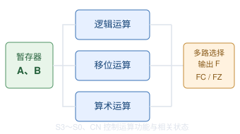

## 运算器实验

运算器是 CPU 中负责执行算术运算和逻辑运算功能部件。  

在 TD-CMA 试验箱中，运算器主要由三个部分组成：  
- **逻辑运算部件**：完成按位与、按位或、按位非等。  
- **移位运算部件**：完成左移、右移、循环移位等。
- **算术运算部件**：完成加法、减法、自增、自减等。

公用两个操作数 A, B 由控制信号决定执行哪种运算。  

Cn：进位控制输入  
FC: 进位标志位(Carry Flag)  
FZ：零标志  

接码之后通过 CON 单元的拨码开关给出二进制数据，利用 LDA, LDB 和 T4 时序脉冲分别写入 A, B 暂存器。  

从计算机组成原理的角度：**基本运算器由操作数暂存器、算术逻辑及移位运算电路、结果选择逻辑和状态标志电路构成。操作数经过时序控制写入暂存器后，由组合逻辑电路并行处理；控制信号选择对应运算功能，结果经过输出控制送至 CPU 内部总线，相关状态标志根据运算类型更新或保持。**  

## S3~S0 控制位
S3~S0 是 4 位控制信号，通过不同的二进制组合虚啊请你在 ALU 执行不同的运算。  

例如，根据实验教材的功能表：

| S3S2S1S0 | 选择的运算 |
| --- | --- |
| 0000 | A 直通 |
| 0001 | B 直通 |
| 0010 | A AND B |
| 0011 | A OR B |
| 0100 | NOT A |
| 0101 | A 循环右移 B 指定的位数 |
| 0110 | 右移运算（由 CN 决定类型） |
| 0111 | 左移运算（由 CN 决定类型） |
| 1001 | A+B |
| 1010 | A+B+FC |
| 1011 | A−B |
| 1100 | A−1 |
| 1101 | A+1 |

其中，1000 用于设置 FC，1110 和 1111 为保留编码。  

在实际 CPU 中，不是人手动拨 S3~S0，而是控制器根据机器指令生成对应的 ALU 控制信号。  

## 三种运算电路

| 运算部件 | 主要电路 | 实现功能 |
| --- | --- | --- |
| 逻辑运算部件 | 与门、或门、非门等 | AND、OR、NOT |
| 移位运算部件 | 桶形移位器 | 左移、右移、循环移位 |
| 算术运算部件 | 加法器等算术逻辑 | 加法、减法、自增、自减 |
