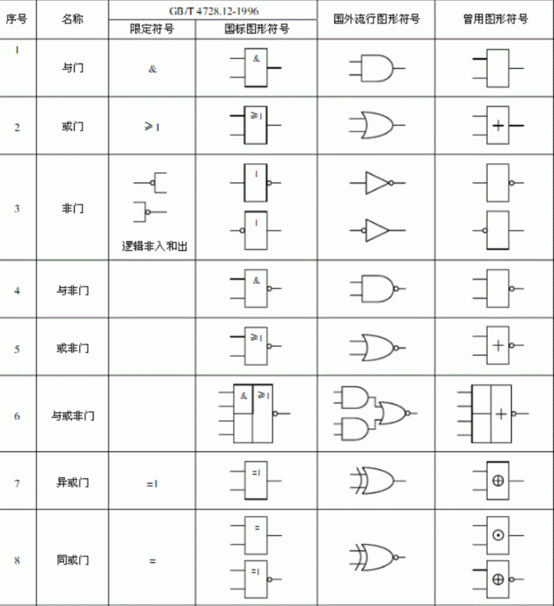

# 1-数字逻辑概述

与、或、非、同或、异或。  
逻辑函数：  
- 真值表、逻辑函数表达式、逻辑图、波形图。  
- 各表示方法之间的转换

## 数字电路特点
1. 数字信号:时间和幅度取值的集合为有限集
基于逻辑运算：逻辑分析的方法
2. 模拟信号:时间和幅度取值的集合为无限集

转换数字信号：采样、离散化、编码...  

## 逻辑运算
输入输出二进制数码，经过逻辑运算处理。  
数学工具：逻辑代数（布尔代数）  
组成：逻辑变量+逻辑运算  
逻辑运算：与、或、非、同或、异或。  

加法：或运算  

基本：与、或、非  
逻辑运算的描述方法：
- 逻辑代数表达式
- 真值表：输入逻辑变量所有取值的组合与其所对应的输出逻辑函数值构成的表格
- 逻辑图

### 逻辑或运算
几个条件中只有一个条件得到满足这件事就会发生。  
$+$ 是逻辑的表示，不是代数运算。  

$$
Y=A+B+...
$$

逻辑或的**真值**表：  
| 输入(A) | B | 输出 (Y) |
|---------|---|----------|
| 0       | 0 | 0        |
| 1       | 0 | 1        |
| 0       | 1 | 1        |
| 1       | 1 | 1        |

### 逻辑与运算

只有当一件事的几个条件全部具备之后，这件事才发生。  

$$
Y=A \cdot B
$$

| 输入(A) | B | 输出 (Y) |
|---------|---|----------|
| 0       | 0 | 0        |
| 1       | 0 | 0        |
| 0       | 1 | 0        |
| 1       | 1 | 1        |

### 逻辑非运算
一件事情的发生是以其相反的条件为依据。  
$$
Y=\bar{A}
$$

| 输入(A) | 输出 (Y) |
|---------|----------|
| 0       | 1        |
| 1       | 0        |

### 逻辑异或运算
对两种信号进行比较、判断，当**两种输入信号不同**输出为 1 ，否则为 0。  
> 只有一个人按下开关时，灯才亮；两个人都没按，或两个人都按了，灯都不亮。  

$$
Y=A\oplus B
$$

| 输入(A) | B | 输出 (Y) |
|---------|---|----------|
| 0       | 0 | 0        |
| 1       | 0 | 1        |
| 0       | 1 | 1        |
| 1       | 1 | 0        |

“异”就是不同，不同为 1，相同为 0。  

### 逻辑同或运算
当对两种信号进行比较、判断，当**两种输入信号相同**输出为 1，否则为 0。  

$$
Y=A\odot B
$$

| 输入(A) | B | 输出 (Y) |
|---------|---|----------|
| 0       | 0 | 1        |
| 1       | 0 | 0        |
| 0       | 1 | 0        |
| 1       | 1 | 1        |

## 复用逻辑运算
### 与非  

$$
Y = \overline{A \cdot B}
$$

### 或非  
$$
Y = \overline{A+B}
$$

### 与或非  
$$
Y = \overline{A\cdot B + C\cdot D}
$$

### more

## 表示方法
- 真值表
- 逻辑表达式
- 逻辑图
- 波形图

### 三人表决电路
输入变量 ABC,两个及其以上的取值为 1 输出才为 1，否则输出为 0。  

| A | B | C | Y |
|---|---|---|---|
| 0 | 0 | 0 | 0 |
| 0 | 0 | 1 | 0 |
| 0 | 1 | 0 | 0 |
| 0 | 1 | 1 | 1 |
| 1 | 0 | 0 | 0 |
| 1 | 0 | 1 | 1 |
| 1 | 1 | 0 | 1 |
| 1 | 1 | 1 | 1 |

$$
Y = \bar{A}BC + A\bar{B}C + AB\bar{C} + ABC
$$

逻辑图
