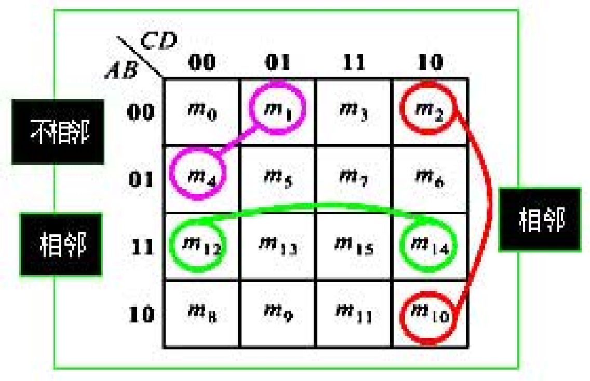

# 逻辑代数基础

$$
Y = A + AB + A\overline{BC} + BC + \overline{B}C
$$

化简。  
## 逻辑函数及其化简
### 逻辑代数化简
#### 公式化简法

$$
\begin{array}{|c|c|c|}
\hline
\text{类别} & \text{公式} & \text{公式} \\
\hline
\text{0-1律} & (1)\ A\cdot 1=A,\quad (3)\ A\cdot 0=0 & (2)\ A+0=A,\quad (4)\ A+1=1 \\
\hline
\text{交换律} & (5)\ A\cdot B=B\cdot A & (6)\ A+B=B+A \\
\hline
\text{结合律} & (7)\ A\cdot(B\cdot C)=(A\cdot B)\cdot C & (8)\ A+(B+C)=(A+B)+C \\
\hline
\text{分配律} & (9)\ A\cdot(B+C)=A\cdot B+A\cdot C & (10)\ A+(B\cdot C)=(A+B)\cdot(A+C) \\
\hline
\text{互补律} & (11)\ A\cdot\overline{A}=0 & (12)\ A+\overline{A}=1 \\
\hline
\text{重叠律} & (13)\ A\cdot A=A & (14)\ A+A=A \\
\hline
\text{反演律} & (15)\ \overline{A\cdot B}=\overline{A}+\overline{B} & (16)\ \overline{A+B}=\overline{A}\cdot\overline{B} \\
\hline
\text{还原律} & (17)\ \overline{\overline{A}}=A & \\
\hline
\end{array}
$$

难点：10, 15, 16  
上面图表左右互为对偶式。  

#### 吸收律

$\text{(18)}\ A+AB=A$  
$\text{(19)}\ A\cdot(A+B)=A$  
$\text{(20)}\ A+\overline{A}B=A+B$  
$\text{(21)}\ AB+\overline{A}C+BC=AB+\overline{A}C$  
$\text{(22)}\ AB+\overline{A}C+BCD=AB+\overline{A}C$  

#### 规则
##### 反演规则（摩根定理）
——便于实现反函数。    
$\overline{A+B}=\overline{A}\overline{B}$
$\overline{A}\overline{B} = \overline{A}+\overline{B}$

##### 对偶规则
使公式的应用范围扩大一倍，使公式的记忆量减小一倍。

$$
\begin{aligned}
&\text{对偶变换：} \\
&\text{“}\cdot\text{”}\to\text{“+”},\qquad
  \text{“+”}\to\text{“}\cdot\text{”}, \\
&\text{“0”}\to\text{“1”},\qquad
  \text{“1”}\to\text{“0”}, \\
&\text{变量保持不变}
\end{aligned}
$$

#### 方法
##### 并项法  
利用公式 $A+\overline{A}=1$ 或公式 $AB+A\overline{B}=A$ 进行化简，通过合并公因子。消去变量。  

例 1：

$$
\begin{aligned}
Y &= A\cdot\overline{B}\cdot C+A\cdot\overline{B}\cdot\overline{C} \\
  &= A\overline{B}(C+\overline{C})=A\overline{B}
\end{aligned}
$$

例 2：

$$
\begin{aligned}
Y &= \overline{A}\cdot\overline{B}\cdot C+\overline{A}\cdot\overline{B}\cdot\overline{C}
   +\overline{A}\cdot B\cdot C+\overline{A}\cdot B\cdot\overline{C} \\
  &= \overline{A}\overline{B}(C+\overline{C})+\overline{A}B(C+\overline{C}) \\
  &= \overline{A}\overline{B}+\overline{A}B=\overline{A}
\end{aligned}
$$

##### 吸收律
利用公式 $A+AB=A$ 化简，消去多余的项。  

例 1：

$$
\begin{aligned}
Y &= A\cdot\overline{B}+A\cdot\overline{B}\cdot CD(E+F) \\
  &= A\overline{B}
\end{aligned}
$$

例 2：

$$
\begin{aligned}
Y &= AB\overline{D}+C\overline{D}+ABC\overline{D}(\overline{E}\overline{F}+EF) \\
  &= AB\overline{D}+C\overline{D}
\end{aligned}
$$

##### 消去法
利用公式 $A + \overline{A}B=A+B$ 进行化简，消去多余项。  

例 1：

$$
\begin{aligned}
Y &= AB+\overline{A}C+\overline{B}C \\
  &= AB+(\overline{A}+\overline{B})C \\
  &= AB+\overline{AB}C \\
  &= AB+C
\end{aligned}
$$

例 2：

$$
\begin{aligned}
Y &= ABCD(E+F)+\overline{E}\overline{F} \\
  &= ABCD(E+F)+\overline{E+F} \\
  &= ABCD+\overline{E+F} \\
  &= ABCD+\overline{E}\overline{F}
\end{aligned}
$$

##### 配项法
在适当的项上乘 $A+\overline{A}=1$ 将一项拆成两项，从而创造并项、吸收或消去的条件。  

例：

$$
\begin{aligned}
Y &= A\overline{B}+B\overline{C}+\overline{B}C+\overline{A}B \\
  &= A\overline{B}+B\overline{C}+(\overline{A}+A)\overline{B}C+\overline{A}B(\overline{C}+C) \\
  &= A\overline{B}+B\overline{C}+\overline{A}\overline{B}C+A\overline{B}C+\overline{A}B\overline{C}+\overline{A}BC \\
  &= A\overline{B}+B\overline{C}+\overline{A}C(\overline{B}+B) \\
  &= A\overline{B}+B\overline{C}+\overline{A}C
\end{aligned}
$$

也就是消去**一致项/冗余项**：  
$$
XY+\overline{X}Z + YZ = XY + \overline{X}Z
$$

其中 $YZ$ 为冗余的一致项。处理方法实际是：遇到第三项$YZ$可以乘$(X+\overline{X})=1$ 再拆开。  

##### 添加项法
配项法是把已有的一项拆开，添加项法则是先人为加一个本来就是冗余的项，再利用它取并项。关键前提是**加进去以后逻辑函数不能变。**    
利用公式 $AB + \overline{A}C + BC = AB + \overline{A}C$，先添加一项 $BC$，然后再利用 $BC$ 进行化简，消去多余项。  

添加项法的特点：**先变复杂，再变简单**。  
例：

$$
\begin{aligned}
Y &= A\overline{B}+B\overline{C}+\overline{B}C+\overline{A}B \\
  &= A\overline{B}+B\overline{C}+\overline{B}C+\overline{A}B+\overline{A}C \\
  &= A\overline{B}+B\overline{C}+\overline{A}B+\overline{A}C \\
  &= A\overline{B}+B\overline{C}+\overline{A}C
\end{aligned}
$$

找一致项：**互补变量删掉，剩下两个因子相乘**  

$$
A\overline{B} + \overline{A}C =A\overline{B} + \overline{A}C + \overline{B}C
$$

#### 记忆
##### 基础公式  
$A + 0 = A$  
$A\cdot 1=A$  
$A + 1 = 1$  
$A\cdot 0 = 0$   
$A+A=A$  
$A\cdot A = A$  
$A\overline{A}=A$  
本质就是：  
- 或 0 不变，或 1 必为 1。  
- 与 1 不变，与 0 必为 0。  
- 自己和自己还是自己。   
- 原变量和反变量“或”为1，“与” 为 0  

##### 交换律  
$A+B=B+A$  
$AB=BA$  

##### 结合律  
$(A+B)+C=A+(B+C)$  
$(AB)C=A(BC)$  
##### 分配律  
$A(B+C)=AB+AC$  

---
$A+BC=(A+B)(A+C)$  

##### 吸收公式
$A+AB=A$，对应的对偶式：$A(A+B)=A$  
$AB$ 已经包含在 $A$ 里面了，所以是多余的。  

---
$A+\overline{A}B=A+B$，对应的对偶式：$A(\overline{A}+B)=AB$  

##### 摩根定律
$\overline{A+B}=\overline{A}\overline{B}$  
$\overline{AB}=\overline{A}+\overline{B}$  
记忆口诀：**长杠拆开，符号翻转**  
也就是：
或变与：$+ \rightarrow \cdot$，与变或：$\cdot \rightarrow \cdot$，并且每个变量都取反。  

### 卡诺图化简

#### 最小项及最小项表达式
最小项要求：**每个变量都必须出现一次，而且只能出现一次**  
对于一个三变量逻辑函数，变量是$A,B,C$，变量可以是原变量也可以是反变量。  
比如：$ABC$, $A\overline{B}C$,$\overline{A}B\overline{C}$, $\overline{A}]overline{B}\overline{C}$。  

一个最小项对应唯一一组输入。比如 $A\overline{B}C$ 要等于一有：$A=1,B=0,C=1$，所以对应：$ABC=101_2$，而$101_2 = 5$，所以 $A\overline{B}C=m_5$ 

#### 最小项表达式
任何一个逻辑函数都可以表示为最小项之和的形式——标准与或表达式。而且这种形式是唯一的，就是一个逻辑函数只有最小项表达式。  

$Y = AB + BC$ 

### 卡诺图

- 最小项在卡诺图中的位置不是任意的，满足相邻性规则。  

几何相邻且逻辑相邻:
- **逻辑相邻**：两个最小项,只有一个变量的形式不同,其余的都相同。逻辑相邻的最小项可以合并。$AC$: $\overline{A}C$, $A\overline{C}$   

几何相邻的含义:  
- 一是**相邻**:紧挨的；
- 二是**相对**:任一行或一列的两头；
- 三是**相重**:对折起来后位置相重。

两变量的卡诺图

比如三变量卡诺图，可以把 \(A\) 放行，\(BC\) 放列：

$$
\begin{array}{c|cccc}
A\backslash BC & 00 & 01 & 11 & 10 \\
\hline
0 & m_0 & m_1 & m_3 & m_2 \\
1 & m_4 & m_5 & m_7 & m_6
\end{array}
$$
例如在这里 $m_1$ 只与 $m_0$, $m_3$, $m_5$ 相邻。所以，卡诺图相邻的本质就是：**两个最小项只差一个变量**。  

卡诺图本质上是把逻辑函数中的最小项按照只差一个变量的关系排列在表格中。  
比如：$F=\sum{m(4,5)}$ 表示: $F=m_4+m_5$。  

其中 $m_4 = A\overline{B}\overline{C}$，$m_5=A\overline{B}C$。  

所以 $F=A\overline{B}\overline{C}+A\overline{B}C$，  
提取公共项 $F=A\overline{B}(\overline{C}+C)$,所以 $F=A\overline{B}$。    
卡诺图只是把上面代数化简的过程画出来，三变量卡诺图只要在 $m_4 m_5$ 处填 1，  
$$
\begin{array}{c|cccc}
A\backslash BC & 00 & 01 & 11 & 10 \\
\hline
0 & 0 & 0 & 0 & 0 \\
1 & 1 & 1 & 0 & 0
\end{array}
$$
所谓圈实际就是：把可以合并的相邻 1 归为一组。  

$m_4$ 和 $m_5$ 中：  

- $A$ 都是 1，因此保留 $A$
- $B$ 都是 0，因此保留 $\overline{B}$
- $C$ 一个是 0，一个是 1，因此 $C$ 被消去  

所以: $F=A\overline{B}$。  
也就是：两个相邻最小项合并，可以消去一个发生变化的变量。  

核心：  
卡诺图=把代数并项画出来。不变的变量留下，变化的变量消掉。  
#### 用卡诺图表示逻辑函数
从真值表画卡诺图：根据变量个数画出卡诺图，再按真值表填写每一个小方块的值（0或1）即可。

先填 1 的，然后记得其余的要补 0。（填的输出）  
如果输出有两个，要画两个卡诺图，卡诺图只能填一个输出变量的取值。  

从最小项表达式画卡诺图：把表达式中所有的最小项在
