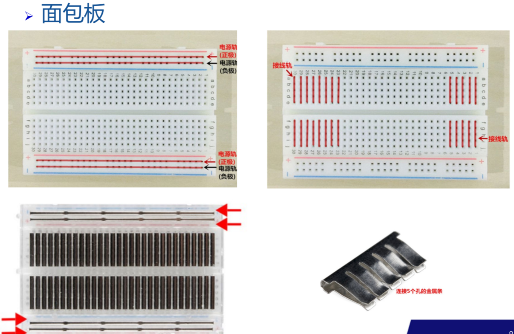
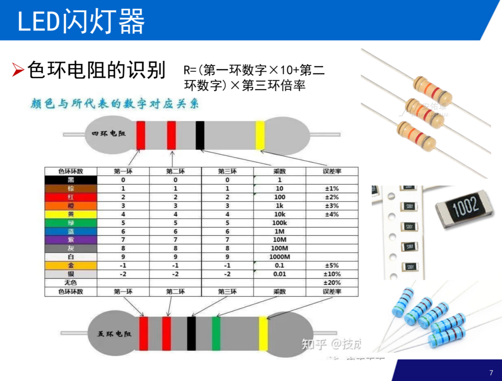
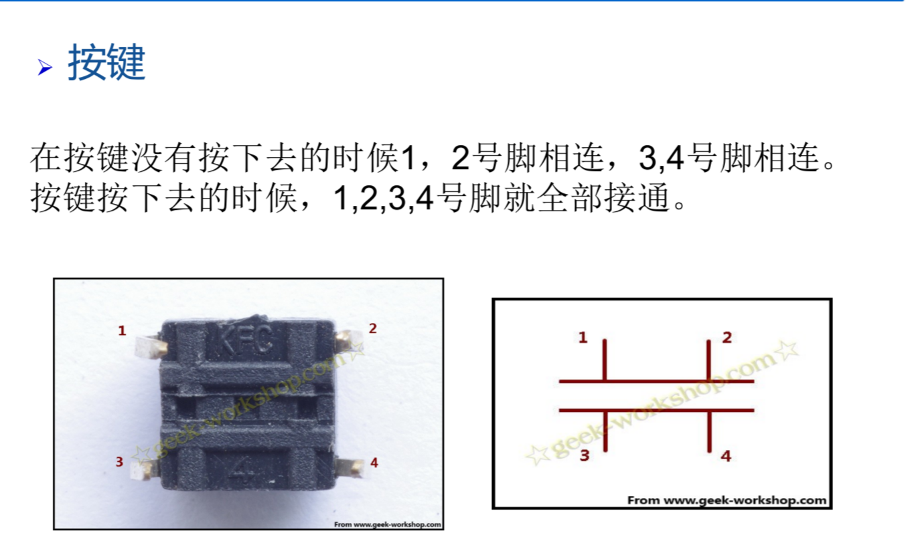

# LED 闪灯实验
## LED
有单向导电性。短的是负极，长的是正极，不能接错。  

LED 反向区正常很小，反向电压过大会击穿 LED。  
LED 亮度与通过的电流成正比，防止电流过大可以利用电阻限流。  

电源串联电阻与 LED 发光电路伏案特性的交点为 LED 灯的工作点。  

220欧：红红综`[(2*10+2)*10]`。  

## 面包板



## 电阻



## 初始化
执行 setup 函数，引脚初始化，外设设置，串口初始化。  


## 闪灯实验
``` c
const int ledpin = 2; // 定义数字 2 接口

void setup() {
    pinMode(ledpin, OUTPUT); // 定义该接口为输出接口
}

void loop() {
    digitalWrite(ledpin, HIGH); // 点亮 LED 灯
    delay(1000); // 延时 1 秒
    digitalWrite(ledpin, LOW); // 熄灭 LED 灯
    delay(1000); // 延时 1 秒
}
```


### 一些函数
``` c
pinMode(pin, MODE);
```

指定引脚工作模式。  

`INPUT` 输入.  
`INPUT_PULLUP` 输入带内部上拉电阻  
`OUTPUT` 输出模式

``` c
digitalWrite(pin, value);
```

指定引脚的输出电平。  
`value` 为指定引脚的输出电压。可分为 `HIGH` 和 `LOW`。  

``` c
delay(value);
```

延时函数，value 为延时时间，单位为 ms。  

## 按键



按下去全部接通，不然就是 1,2 接通，3,4 接通。  

