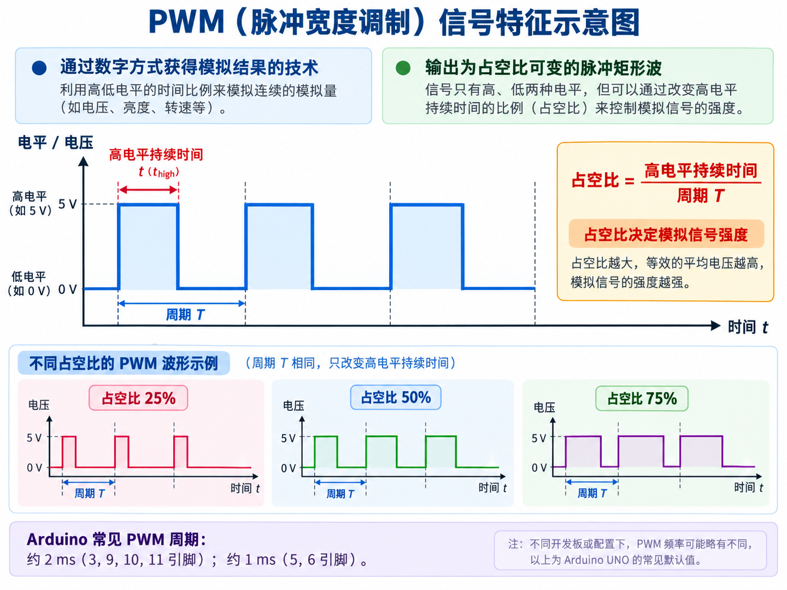

# 实验二 Arduino 模拟 IO

声音、温度通过模数转换(ADC)转换为计算机能识别的信号: 0 和 1。  
数字 IO 只有 High, Low 两种状态，以 Arduino UNO 5V 参考电压为例：  
- High: 5V
- Low : 0V

模拟 IO 是 0-5V 之间的任意值。  

数字 IO 可设定输入输出。   
模拟 IO 的输入输出是固定的：    
A0-A5 为模拟 IO 输入口，3,5,6,9,10,11 为模拟 IO 输出口(带 ~ 符号的端口)。  

模拟 IO 的输入引脚带有 10bit ADC:  
0-5V 模拟电压： 0-1023 整数  
0V => 0 5V => 1023  

$$
ADC = \frac{输入电压}{5V} \times 1023
$$

`analogRead(pin)` 函数：  
- pin 为被读取的引脚编号
- pin 必须为模拟 IO 的输入引脚
- 读取 pin 的输入电压并转换为数字信号
- 返回数字信号，即 0-1023 之间的整数

模拟 IO 的输出:  
模拟 IO 输出没有 DAC 功能  
脉冲宽度调制 PWN  
- 通过数字方式获得模拟结果的技术  
- 标点为占空比可变的脉冲矩形波  
- Arduino 的 PWN 周期  
    * 约为 2ms (3,9,10,11 引脚)
    * 约为 1ms(5,6 引脚)

> 占空比：高电平持续时长占总周期的比例  
> 占空比大小决定模拟信号强度  



LED 亮灯实验：  
占空比为 1 => LED 100% 亮度：5V 模拟电压  
占空比为 0.5 => LED 50% 亮度 => 2.5V 模拟电压  

`analogWrite()`模拟 IO 写函数

``` c
void analogWrite(unit8_t pin, int value);
```

参数类型：  
- pin: 支持 PWN 的数字引脚编号
- value: 占空比值,0 到 255 之间的整数  
0% 占空比： value = 0, 50 % 占空比 value = 127……  

只是输出 PWN 信号，不是真正的模拟电压。如果需要真正的模拟电压输出，需要使用外部 DAC 模块或者 RC 滤波电路  

应用：LED 调光,电机控制，音频输出。    


PWN 脉冲宽度调制  
- 通过数字方式获得模拟结果的技术  
- 表现为占空比可变的脉冲矩形波  

```
CPU-指令>8位定时器-PWN波>输出引脚-点亮>LED灯
```


### 控制LED亮度

### 呼吸灯
将 LED 连接到 PWN 引脚

### 电位器控制 LED 亮度

电位器：三个段子，其中有两个固定接点与一个滑动接点。可以经由滑动而改变滑动段与两个固定端尖电阻值的电子零件，使用时可以形成不同的分压比率。  


读取指定模拟引脚的电压值，并将其转换为 10 位数字值。  
``` c
int analogRead(uint8_t pin);
```

返回值： 0 到 1023 之间的整数值。  

十位 ADC 转换器。  

```c
void analogReference(uint8_t type);
void analogReference(INTERNAL); // 使用内部 1.1 V 基准
```

设置模拟输入引脚(ADC)的参考电压基准。  


```c
long map(long x, long in_min, long in_max, long out_min, long out_max);
```

数值转换函数，将一个数值从一个范围线性映射到另一个范围。
是等比映射的。 

参数说明：

- `x`：待转换的输入值。
- `in_min`：输入范围下限。
- `in_max`：输入范围上限。
- `out_min`：输出范围下限。
- `out_max`：输出范围上限。

映射公式为：

$$
y=(x-in\_min)\frac{out\_max-out\_min}{in\_max-in\_min}+out\_min
$$


``` c
abc = map(abc, 0, 1023, 0, 255);  // 将 0~1013 映射到 0~255
```


