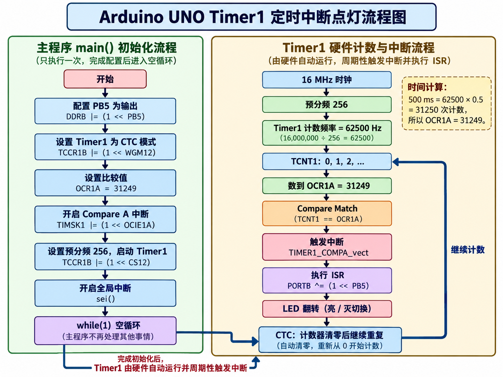

# 中断点灯


## 前置知识
UNO 的 ATmega328P 主频是： 16 MHz。所以 CPU 有一个 16 MHz 时钟。  

Timer1 是 16 bit 计数器，最大只能 65535，所以 Timer 前面有一个 Prescaler 预分频器。  

### OCR1A(Output Compare Register 1 )
可以理解成 Timer1 的目标值

``` c
TIMSK1 |= (1 << OCIE1A);
```

当 Timer1 Compare A 匹配的时候，允许产生中断。当产生中断就跳到 `ISR(TIMER1_COMPA_vect)` 也就是这里每 500 ms 执行一次。进行异或计算。  


### sei
前面写 `TIMSK1` 是 Timer 1 Compare A 中断自己允许，而 `sei()` 是 CPU 总中断开关打开。  


### CTC(Clear Timer on Compare Match)
定时器数到指定的比较值后自动清零，然后从 0 开始计数。  
比 OCR1A = 249，当 TImer1 数到 249 时发生 Compare Match 随后自动回到 0。  
还有一个 prescaler。如果 parescaler = 64 有：  

$$
f_{timer} = \frac{16MHz}{64} = 250 kHz
$$

则 Timer 每次加 1 的时间为 $T_{tick} = 4\mu s$   
想要 1ms 就需要数 250 次。  

### TCNT1(TImer/Counter 1 Register)
TCNT1 是 TImer1 的计数寄存器，表示 TImer1 数到多少了。  

## 头文件扩展
### avr/interrupt.h
这里提供 avr 中断。  
比如 sei() 的定义其实是内联 AVR 汇编：  
``` c
#define sei() __asm__ __volatile__("sei ; [[len=1]]" ::: "memory")
```

---

首先写 DDRB 把 PB5 设置为输出。  

### Timer1 设置 CTC
``` c
TCCR1B |= (1 << WGM12);
```

TCCR1B 宏定义为：
``` c
#define TCCR1B _SFR_MEM8(0x81)
(*(volatile uint8_t *)(0x81)) // 展开变成
```

实际就是修改 ATmega328P 数据空间地址 0x81。  

对于控制的是 Timer1 的控制缓存器。  

Timer1 一共有 4 个位共同选择模式：  
```
WGM13 WGM12 WGM11 WGM10
```

要 CTC 模式就是 Mode4 所以把 WGM12 置 1 就是 4，这样来说直接往里写。  

这里含义就是把 WGM12 这一位设为 1配合其余 WGM 位为 0 形成 Timer1 Mode 4: CTC。  

###  设置 OCR1A
把 31249 写入 TImer1 的比较寄存器 A。  
因为选择了 CTC 所以数到 31249 之后会触发 Compare Match 然后 TCNT1 回到 0。  

### 设置 TCCR1B
``` c
TCCR1B |= (1 << CS12);
```

TCCR1B 有 CS12:CS11:CS10 这样 100 组合文档就是写的 256 分频。  
这里写入 TCCR1B 让 Timer1 使用 CPU 时钟 / 256 的记时方法也就是：  

$$
\frac{16 000 000}{256} = 62 500 Hz
$$

这样让 Timer1 每秒数 62500 次，使得 500 ms 为 31250 上一行到 OCR1A 写入的即是。  


### 设置 TIMSK1
```c
TIMSK1 |= (1 << OCIE1A);
```

TIMSK1  是 Timer 中断屏蔽/使能寄存器。决定 Timer1 的哪些事件允许触发 CPU 中断。写入 OCIE1A 就是允许 Timer1 的 Compare A 匹配事件触发中断。  

这样只要全局中断开启就会执行对应 ISR。  

## 中断向量
``` c
ISR(TIMER1_COMPA_vect)
{
    // 每 500 ms 执行一次
    PORTB ^= (1 << PB5);
}
```

这里写入一个 AVR interrupt handler 就会将这个函数放到 Timer1 Compare A 的中断向量上。  这样每隔 500ms 异或一次，就会每隔 500ms 翻转一次比特位就闪灯了。  




## 扩展
到这就结束了吗，初识中断但这样直接的跳跃 CPU 可没有那么聪明。这样突然打断执行流 CPU 的上下文一定是需要保存的。    
CPU 实际在前面初始化寄存器后一直在 while(1) 里面循环，在硬件上 Timer1 一直在进行计数，且中断的位已经开启。当触发 Compare Match 就会触发中断进入 TIMER1_COMPA_vect 所在的中断向量表跳转对应位置执行。  
这其中需要保存当前上下文。实际就是保存到栈。  
ATmega328P 有 SRAM 静态 RAM，可以放会变化数据，但只有 2KB。ATmega328P 的栈通常从 SRAM 顶部开始，由 SP 栈指针寄存器来指向。中断发生时硬件会往栈上放入 PC 也就是 return address。同时还需要保存清除 SREG.I 防止再次中断导致嵌套。  

但单纯保存 PC 肯定不够的，CPU 上很多寄存器都需要保存，编译器还会额外保存这些到栈上，这些就是保存上下文。  

比如我们上面写的中断向量反汇编后代码为：  
``` asm
00000080 <__vector_11>:
  80:	8f 93       	push	r24
  82:	8f b7       	in	r24, 0x3f	; 63
  84:	8f 93       	push	r24
  86:	9f 93       	push	r25
  88:	85 b1       	in	r24, 0x05	; 5
  8a:	90 e2       	ldi	r25, 0x20	; 32
  8c:	89 27       	eor	r24, r25
  8e:	85 b9       	out	0x05, r24	; 5
  90:	9f 91       	pop	r25
  92:	8f 91       	pop	r24
  94:	8f bf       	out	0x3f, r24	; 63
  96:	8f 91       	pop	r24
  98:	18 95       	reti
```

就用 push pop 做了保存上下文的工作。   
最后用 `reti` 而非普通的 `ret` 来做函数返回。  
`reti` 是 Return from Interrupt，不仅返回地址继续执行，还承担中断返回所需的 CPU 状态语义，包括重新允许后续中断。  


同样的，中断向量保存在最开始的地址，反汇编也可以看到：  

``` asm
00000000 <__vectors>:
   0:	0c 94 34 00 	jmp	0x68	; 0x68 <__ctors_end>
   4:	0c 94 3e 00 	jmp	0x7c	; 0x7c <__bad_interrupt>
   8:	0c 94 3e 00 	jmp	0x7c	; 0x7c <__bad_interrupt>
   c:	0c 94 3e 00 	jmp	0x7c	; 0x7c <__bad_interrupt>
  10:	0c 94 3e 00 	jmp	0x7c	; 0x7c <__bad_interrupt>
  14:	0c 94 3e 00 	jmp	0x7c	; 0x7c <__bad_interrupt>
  18:	0c 94 3e 00 	jmp	0x7c	; 0x7c <__bad_interrupt>
  1c:	0c 94 3e 00 	jmp	0x7c	; 0x7c <__bad_interrupt>
  20:	0c 94 3e 00 	jmp	0x7c	; 0x7c <__bad_interrupt>
  24:	0c 94 3e 00 	jmp	0x7c	; 0x7c <__bad_interrupt>
  28:	0c 94 3e 00 	jmp	0x7c	; 0x7c <__bad_interrupt>
  2c:	0c 94 40 00 	jmp	0x80	; 0x80 <__vector_11>
  30:	0c 94 3e 00 	jmp	0x7c	; 0x7c <__bad_interrupt>
  34:	0c 94 3e 00 	jmp	0x7c	; 0x7c <__bad_interrupt>
  38:	0c 94 3e 00 	jmp	0x7c	; 0x7c <__bad_interrupt>
  3c:	0c 94 3e 00 	jmp	0x7c	; 0x7c <__bad_interrupt>
  40:	0c 94 3e 00 	jmp	0x7c	; 0x7c <__bad_interrupt>
  44:	0c 94 3e 00 	jmp	0x7c	; 0x7c <__bad_interrupt>
  48:	0c 94 3e 00 	jmp	0x7c	; 0x7c <__bad_interrupt>
  4c:	0c 94 3e 00 	jmp	0x7c	; 0x7c <__bad_interrupt>
  50:	0c 94 3e 00 	jmp	0x7c	; 0x7c <__bad_interrupt>
  54:	0c 94 3e 00 	jmp	0x7c	; 0x7c <__bad_interrupt>
  58:	0c 94 3e 00 	jmp	0x7c	; 0x7c <__bad_interrupt>
  5c:	0c 94 3e 00 	jmp	0x7c	; 0x7c <__bad_interrupt>
  60:	0c 94 3e 00 	jmp	0x7c	; 0x7c <__bad_interrupt>
  64:	0c 94 3e 00 	jmp	0x7c	; 0x7c <__bad_interrupt>
```

可以看出，目前只有 0x2c 地址被设置为例 __vector_11 其他都没有设置。  


