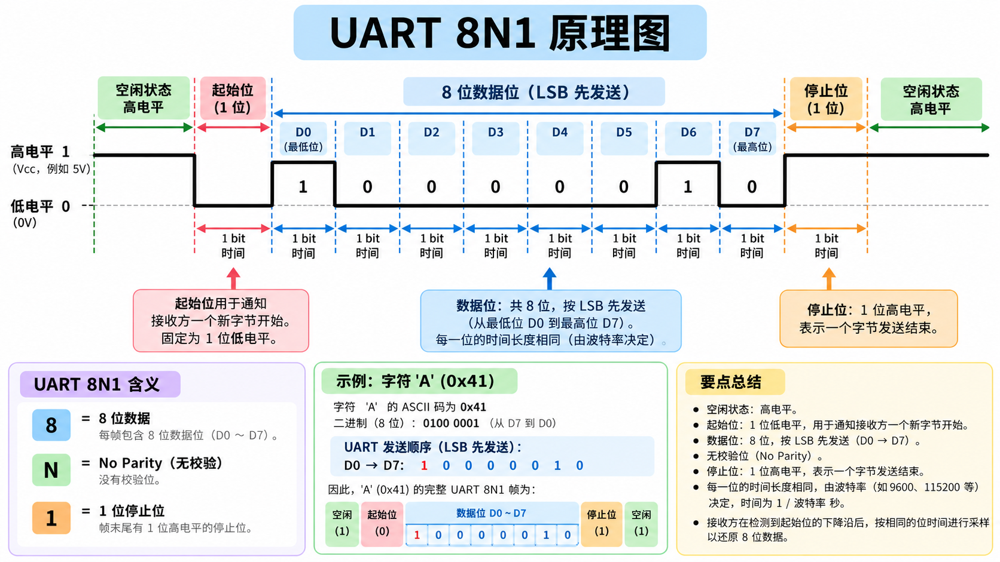

# UART 发送
整理过程就是 CPU 写 UDR0 然后 USART0 的发送硬件把字节拆成 UART frame 通过 TX 引脚到USB 串口芯片发送。  

## UART
UART 其实就是通用异步收发器(Universal Asynchronous Receiver/Transmitter)。把 CPU 里的字节一个 bit 一个 bit 地从引脚发出去，或者把引脚上收到的一串 bit 重新拼成字节。  

UART 只有 TX, RX 和 GND。双方必须提前约定每秒传多少 bit，这也就是波特率。一般是 9600 baud 也就是 96000 bit/s.    

UART 会给每个字节加上一个简单的帧结构，最常见就是 8N1：



ATmega328P 的 UART 外设叫的 USART0, TX = PD1, RX = PD0。  

## 初始化 UART
``` c
/* 初始化 UART
 * 配置波特率，打开发送器配置 8N1
 */
void uart_init(void)
{
    UBRR0 = 103; // 波特率 9600

    UCSR0B |= (1 << TXEN0); // 开启发送器

    // 8 data bits
    UCSR0C |= (1 << UCSZ01) | (1 << UCSZ00);
}
```

### 波特率
`UBRR0 = 103;` 这里 UBRR0 是 USART Baud Rate Register 0 决定 UART 发送 bit 的速度。  

在普通异步模式下:  

$$
Baud=\frac{F_{CPU}}{16(UBRR0+1)}
$$
而在 UNO $F_{CPU} = 16 000 000$ 要求 baud = 9600 就要 UBRR0 = 103.17 也就是 103。差不多就是 9600 baud。  

> UBRR0 其实是两个寄存器，但 ATmega328P 是 8 位 MCU，但波特率需要超过 8 bit 所以硬件有 UBRR0H 和 UBRR0L 。  

### 给发送器使能
``` c
UCSR0B |= (1 << TXEN0);
```

UCSR0B 就是 USART Control and Status Register 0 B，也就是 USART0 的一个控制寄存器。  
其中的 TXEN0 就是负责发送器使能。  

### 规定字符长度
``` c
UCSR0C |= (1 << UCSZ01) | (1 << UCSZ00);
```

这里把 UCSZ01 和 UCSZ00 置 1。  
UCSR0C 有 UCSZ02:UCSZ01:UCSZ00 ，这里是 011 代表 8 data bits。 也就是 8N1 的 8 来源。  
8N1 的 N 是 No parity 由 UPM01:0 设置 00……  

| 含义 | 寄存器位 | 设置 |
|---|---|---:|
| 8 位数据 | `UCSZ02:0` | `011` |
| No Parity | `UPM01:0` | `00` |
| 1 个停止位 | `USBS0` | `0` |
| 异步 UART | `UMSEL01:0` | `00` |


设置的时候只需要把 8 位数据置 1 就可以，其他都是默认 0。  

---
到这里，UART 初始化完成。  


## 发送一字符
```c
void uart_putc(char c)
{
    while (!(UCSR0A & (1 << UDRE0))) // 等待发送数据
    {
    }

    UDR0 = c; // 要发送的数据
}
```

这里 `!(UCSR0A & (1 << UDRE0))` 一直等到 USART 发送寄存器空了，能够接受下一个字节。不然就在 while 里等待空转。  

- UDRE0 是 USART Data Register Empty ，是 UCSR0A 的状态位。若为 1 则发送寄存器已经空了，可以写新数据。写掩码然后用按位与检查这一位。  

如果空了就往 UDR0 写入字节，然后发送。  


## 发送字符串
字符串本身其实就是一串连续字符，所以实际可以遍历字符串不断调用 `uart_putc()` 来实现。  

``` c
void uart_puts(const char *s)
{
    while (*s)
    {
        uart_putc(*s);
        s++;
    }
}
```

## 发送 u32
这里不展开，见原码，就是把 u32 处理成字符串然后逐字节用 putc 打印。  
## 进阶：定时中断打印 tick  
定义一个全局的 tick 向量，用 volatile 修饰，确保每次都真实去读内存：  
``` c
volatile uint32_t tick = 0;
```


从先前的定时中断的代码中提取 timer_init 初始化函数：  

```c
// 初始化 timer1
void timer1_init(void)
{
    // TCC 模式
    TCCR1B |= (1 << WGM12);

    // 每 1 ms
    OCR1A = 249;

    // 开启 Compare 中断
    TIMSK1 |= (1 << OCIE1A);

    // 64 分频
    TCCR1B |= (1 << CS11) | (1 << CS10);
}
```

写中断函数：  

``` c
// Timer1 Compare Match 中断
ISR(TIMER1_COMPA_vect)
{
    tick++;
}
```

这样就可以把 delay 和真实 tick 结合在一起也就是：  

``` c
int main()
{
    uart_init();
    uint32_t tick = 0;
    while (1)
    {
        uart_puts("tick =");
        uart_put_u32(tick);
        uart_puts("\r\n");
        tick += 1000;
        _delay_ms(1000);
    }
}
```

实际效果：  
```
tick =234597
tick =235613
tick =236629
tick =237645
tick =238661
tick =239677
tick =240694
tick =241710
tick =242726
```

不错的，因为 UART 也需要时间嘛，delay 也不是很正确。  
这里每次都差值差不多是 16，也是有意义的，但就不展开了。  

CPU 会不断被 UART polling 阻塞 CPU。  

UNO 的 CPU 是一个 8 位的 CPU，而 tick 是 32 位的无符号整数。其实 CPU 需要逐 8 位去读这个变量，有时候中断可能插在这其中就可能会出问题。所以需要用 ATOMIC_BLOCK 来确保每次读的时候都一次完成 4 字节读取，不会在中间触发中断。  

## 原子
avr-libc 有 `util/atomic.h` 可以做原子处理：  

main 文件改成：  
``` c
int main()
{
    uint32_t snaphost;
    uart_init();
    timer1_init();

    sei();

    while (1)
    {
        ATOMIC_BLOCK(ATOMIC_RESTORESTATE)
        {
            snaphost = tick;
        }

        uart_puts("tick =");
        uart_put_u32(snaphost);
        uart_puts("\r\n");

        _delay_ms(1000);
    }
}
```
这样在读取的时候 Timer ISR 进不来，确保 4 字节都是来自同一个 tick。而且不能直接把 uart 函数放进去，这样会很大的阻塞中断。需要临界区尽可能小。  

`ATOMIC_BLOCK(ATOMIC_RESTORESTATE)` 实际是保存原状态然后 cli 关掉中断运行完成后再恢复原状态打开中断。  
