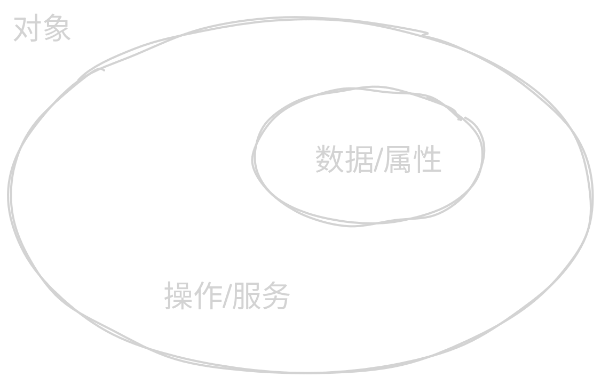

# 绪论
## 课堂要求
智慧树平台签到、作业、实验缴交。  

## why learn
面向过程、面向对象  

## OOP
核心思想： **把问题分解成一系列需要完成的步骤**  
### 模块化  
整个系统分解成若单模块  

### 语言结构化  

### 自顶向下、逐步求精  
把程序看成是逐步演化的过程。  
先向好程序要做什么，在一步步细化。  

封装、继承、多态  

## 对象
程序=对象+消息（函数调用）  

不能直接操作数据（数据成员），只能通过操作、接口来操作。  
操作/服务（成员函数）对内部数据起到保护的作用，  
可扩展性、可维护性。  

## 类
类是对象的抽象、对象是类的实例。  
类就是**具有相同属性和相同的操作的一组对象的抽象**。  

## 封装
把数据和方法打包到一起。隐藏内部数据、只暴露安全的操作接口  
好处： 安全性、简化使用、易于维护  

## 继承
父类、子类。子类继承父类共有的特点。  
好处：
1. 代码复用  
子类自动拥有父类所有成员  

1. 易于维护  
修改父类一处，所有子类生效

1. 易于扩展  

## 多态
不同对象在收到相同消息时产生多种不同的行为。  

如：函数重载，  
符号也有多态性：`<<` 、 `&`

## 为什么使用面向对象程序设计

- 面向过程：性能更高，代码更简单。（性能敏感，逻辑简单的场景：科学计算、数值分析）更适合底层开发  
- 面向对象：更好的代码组织和维护：扩展、复用。更适合大型项目   

## 支持面向对象的语言
略
