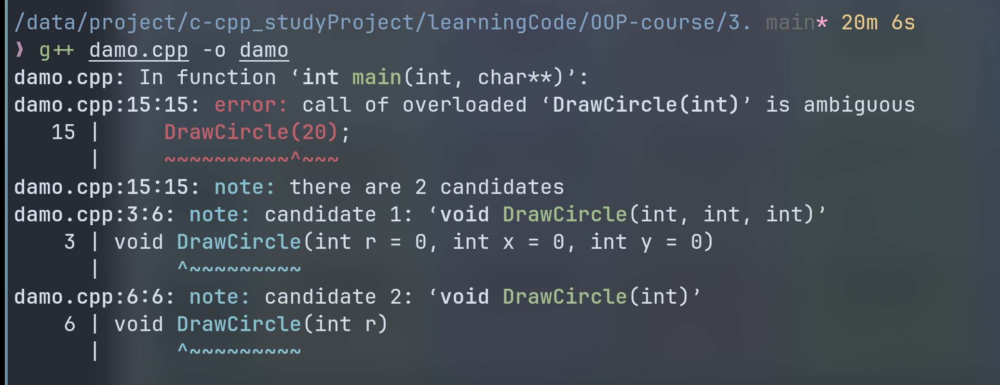
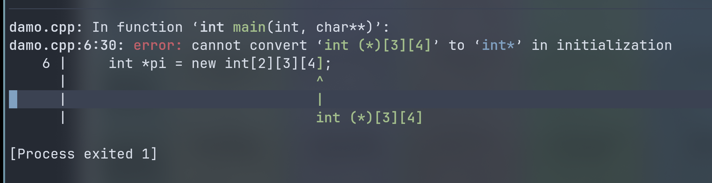
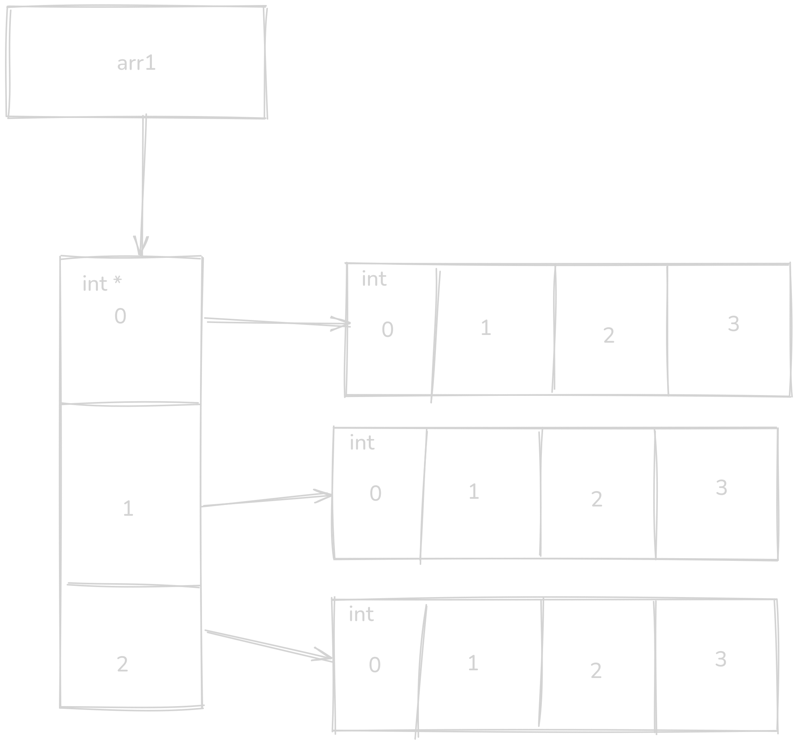
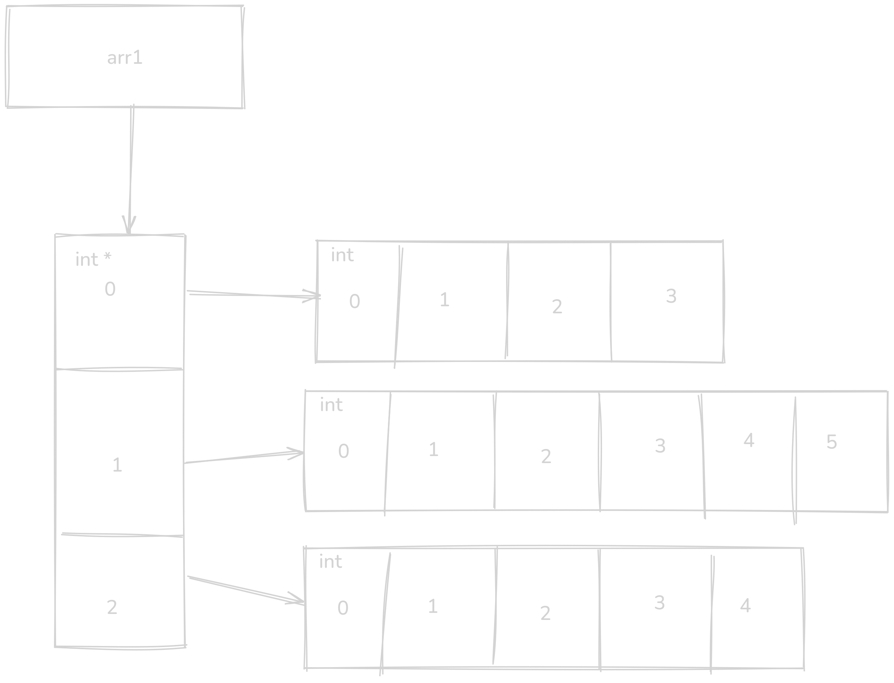
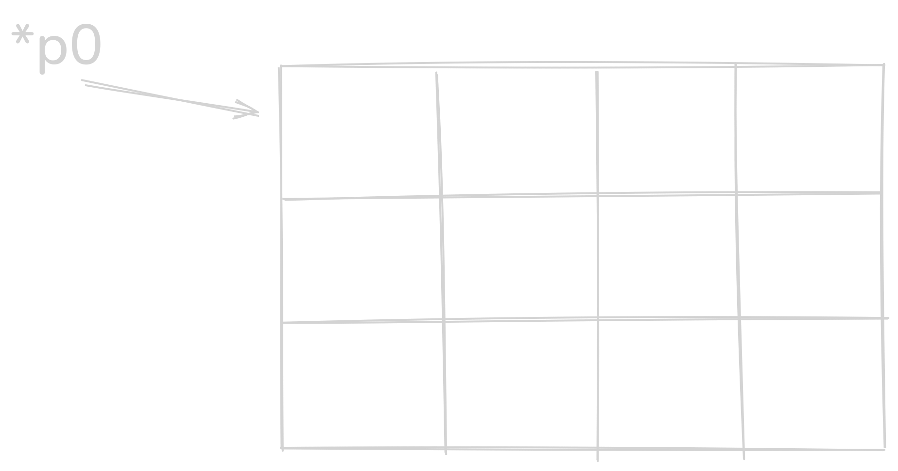
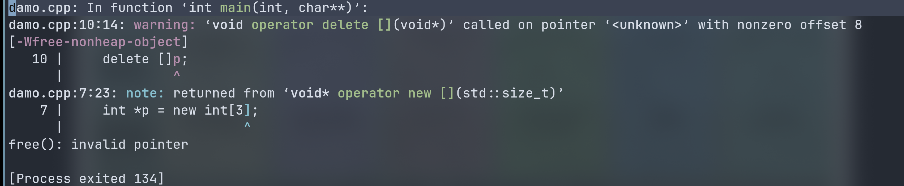

# C++ 在非面向对象方面的补充 

## 头文件
现在的C++标准库头文件不带后缀：  
``` cpp
#include <iostream>
```

## 注释行
以 `//` 开始注释内容只能在本行起作用  
以 `\*..*\` 方式的注释为其之间的所有内容

## C++ 的输入输出
C++ 提供了更安全的和更方便的 I/O 写法。  
`std::cout` `std::cin`  

``` cpp
std::cout << (1 << 2) << std::endl;
```

## 灵活的局部变量声明
C++ 运行在代码块的任何地方声明局部变量  

## 结构、联合和枚举名可以直接作为类型名

定义变量时不必再结构名、联合名或枚举名前冠以 `struct`、`union` 和 `enum`。  
C 语言：
``` c
typedef struct Point
{
    int x, y;
}PT;

Point pt;
```

C++:
``` cpp
struct Point
{
    int x, y;
};

Point pt;
```

啰啰嗦嗦的 struct 的新特性：
``` cpp
{
    /*
        struct Point
        {
            int x, y;
        };

        Point pt = {1, 2};
    */
    struct Point
    {
        int x, y;
        Point(int x, int y) : x(x), y(y)
        {
            std::cout << x << " " << y << std::endl;
        }
    };

    Point pt(1, 2);

    return 0;
}
```

## const 修饰符
不好的码风：  
``` c
for (index = 0; index < 512; ++index)
```
512 可读性不好。  

可以这样：

``` c
int bufSize = 512;
for (index = 0; index < bufSize; ++index)
```

但是用 const 就更好：

``` cpp
const int bufSize = 512;
for (index = 0; index < bufSize; ++index)
```
> 
> ``` c
> #define LIMIT 100
> ```
> 预编译时的符号替换    
> 无类型  
> define 不安全，直接替换。补救：`()`，`do{}while(0)`     


const 即常量修饰符。  

### const 指针
用例：
``` cpp
int value = 10;
int other = 20;
const int *p1 = &value;
//*p1 = 30; //报错
// p1 = &other; // 可以运行
std::cout << "p1=" << *p1 << ";" << "value=" << value << std::endl;
int *const p2 = &other;
// *p2 = 30; // 可以运行
// p2 = &value; // 报错
std::cout << "p2=" << *p2 << ";" << "other=" << other << std::endl;
```

地址不能变，但是值可以变  
``` cpp
int *const p = &value;
```

地址能变，但是值不能变  
``` cpp
const int *p = &value;
```


**勘误**:
``` cpp
    char * const name = "chen";
    name[3] = 'a';  // 段错误
```
编译通过，但是运行时错误（非法访问）  
应该这样写：
``` cpp
char arr[] = "chen";
name[3] = 'a';
```

> 勘误：~~如果 const 定义是一个整形常量，关键字 int 可以省略。~~(现在不能省略)  
- 函数形参可以用 const 说明，用于保证形参在函数内部不被改动。  

## 函数原型
在 C++ 中有如下几种声明方式：
``` cpp
int add (int a, in b);
int add(); // 有警告
add(); // 现在已经不行了
```

C++ 中函数原型的定义形式：
类型 函数名(参数类型说明列表)  

- 可以没有参数名，而只需要有类型名  
``` cpp
int sum(int, int);
int sum(int a, int b);
```

- 参数名无所谓，只取决与类型名和个数  

main 声明一定为 int 型。  
``` cpp
int main()
```


## 内联函数
``` cpp
int min(int v1, int v2)
{
    return (v1 < v2 ? v1 : v2);
}
```

调用函数比直接计算条件操作符要慢  
可以使用 define  
```cpp
#define min(v1, v2) ((v1) < (v2) ? (v1) : (v2))
```

但是有时候这种方式会有奇奇怪怪的问题：
``` cpp
#define min(v1, v2) ((v1) < (v2) ? (v1) : (v2))
int main(int argc, char *argv[])
{
    int x = 3, y = 5, z;
    z = min(x++, y);
    std::cout << z << " " << x;
    return 0;
}
```
输出： `4 5` ，显然 x 值预期应该是 4 因为显式的 x 只自增了一次  

可以用 `inline` 采用内联函数，消除 define 的不安全因素  
``` cpp
inline int min(int v1, int v2) {
    return (v1 < v2 ? v1 :v2);
}
```
它将在程序中每个调用点上被内联地展开  
``` cpp
int a = min(n, m);
// 编译后变成
int a = n < m ? n : m;
```

inline 对编译器来说只是一个建议，具体是否内联看编译器
使用策略：只优化小的、只有几行的、经常被调用的函数  

将该代码编译后 objdump 反汇编来探究:  

> `__attribute__` 可以设置函数属性  
```cpp
__attribute__((noinline))
inline int min_noinline(int v1, int v2)
{
    return (v1 < v2 ? v1 :v2);
}

__attribute__((always_inline))
inline int min_inline(int v1, int v2)
{
    return (v1 < v2 ? v1 :v2);
}
int main(int argc, char *argv[])
{
    int x = 3, y = 5, z;
    z = min_inline(x++, y);
    z = min_noinline(x++, y);
    std::cout << z << " " << x;
    return 0;
}
```

反汇编：
``` asm
0000000000001149 <main>:
    1149:	55                   	push   %rbp
    114a:	48 89 e5             	mov    %rsp,%rbp
    114d:	48 83 ec 30          	sub    $0x30,%rsp
    1151:	89 7d dc             	mov    %edi,-0x24(%rbp)
    1154:	48 89 75 d0          	mov    %rsi,-0x30(%rbp)
    1158:	c7 45 ec 03 00 00 00 	movl   $0x3,-0x14(%rbp)
    115f:	c7 45 f0 05 00 00 00 	movl   $0x5,-0x10(%rbp)
    1166:	8b 45 ec             	mov    -0x14(%rbp),%eax
    1169:	8d 50 01             	lea    0x1(%rax),%edx
    116c:	89 55 ec             	mov    %edx,-0x14(%rbp)
    116f:	89 45 f8             	mov    %eax,-0x8(%rbp)
    1172:	8b 45 f0             	mov    -0x10(%rbp),%eax
    1175:	89 45 fc             	mov    %eax,-0x4(%rbp)
    1178:	8b 45 f8             	mov    -0x8(%rbp),%eax
    117b:	3b 45 fc             	cmp    -0x4(%rbp),%eax
    117e:	7d 05                	jge    1185 <main+0x3c>
    1180:	8b 45 f8             	mov    -0x8(%rbp),%eax
    1183:	eb 03                	jmp    1188 <main+0x3f>
    1185:	8b 45 fc             	mov    -0x4(%rbp),%eax
    1188:	89 45 f4             	mov    %eax,-0xc(%rbp)
    118b:	8b 45 ec             	mov    -0x14(%rbp),%eax
    118e:	8d 50 01             	lea    0x1(%rax),%edx
    1191:	89 55 ec             	mov    %edx,-0x14(%rbp)
    1194:	8b 55 f0             	mov    -0x10(%rbp),%edx
    1197:	89 d6                	mov    %edx,%esi
    1199:	89 c7                	mov    %eax,%edi
    119b:	e8 43 00 00 00       	call   11e3 <_Z12min_noinlineii>
    11a0:	89 45 f4             	mov    %eax,-0xc(%rbp)
    11a3:	8b 45 f4             	mov    -0xc(%rbp),%eax
    11a6:	48 8d 15 93 2e 00 00 	lea    0x2e93(%rip),%rdx        # 4040 <_ZSt4cout@GLIBCXX_3.4>
    11ad:	89 c6                	mov    %eax,%esi
    11af:	48 89 d7             	mov    %rdx,%rdi
    11b2:	e8 89 fe ff ff       	call   1040 <_ZNSolsEi@plt>
    11b7:	48 89 c2             	mov    %rax,%rdx
    11ba:	48 8d 05 43 0e 00 00 	lea    0xe43(%rip),%rax        # 2004 <_IO_stdin_used+0x4>
    11c1:	48 89 c6             	mov    %rax,%rsi
    11c4:	48 89 d7             	mov    %rdx,%rdi
    11c7:	e8 64 fe ff ff       	call   1030 <_ZStlsISt11char_traitsIcEERSt13basic_ostreamIcT_ES5_PKc@plt>
    11cc:	48 89 c2             	mov    %rax,%rdx
    11cf:	8b 45 ec             	mov    -0x14(%rbp),%eax
    11d2:	89 c6                	mov    %eax,%esi
    11d4:	48 89 d7             	mov    %rdx,%rdi
    11d7:	e8 64 fe ff ff       	call   1040 <_ZNSolsEi@plt>
    11dc:	b8 00 00 00 00       	mov    $0x0,%eax
    11e1:	c9                   	leave
    11e2:	c3                   	ret

00000000000011e3 <_Z12min_noinlineii>:
    11e3:	55                   	push   %rbp
    11e4:	48 89 e5             	mov    %rsp,%rbp
    11e7:	89 7d fc             	mov    %edi,-0x4(%rbp)
    11ea:	89 75 f8             	mov    %esi,-0x8(%rbp)
    11ed:	8b 45 fc             	mov    -0x4(%rbp),%eax
    11f0:	3b 45 f8             	cmp    -0x8(%rbp),%eax
    11f3:	7d 05                	jge    11fa <_Z12min_noinlineii+0x17>
    11f5:	8b 45 fc             	mov    -0x4(%rbp),%eax
    11f8:	eb 03                	jmp    11fd <_Z12min_noinlineii+0x1a>
    11fa:	8b 45 f8             	mov    -0x8(%rbp),%eax
    11fd:	5d                   	pop    %rbp
    11fe:	c3                   	ret
```

可见只有 min_noinline 函数，而没有  min_inline 函数，min_inline 内联展开到 main 函数了。   
## 带有默认参数的函数
在函数定义或函数声明中指定了初始值的参数称为默认参数。  
``` cpp
int special(int x = 5, double y = 5.3);
```
调用的时候可以不给任何参数，直接用默认参数。  
默认参数必须从右向左连续定义，**不能跳跃**，并且在一个默认参数的右边不能有未指定到默认值。  

函数定义在前，函数声明在后，函数定义中指定默认值。  
函数调用在前，函数定义在后，函数声明中指定默认值，在函数定义时就不要给了。  

```cpp
//例如这样不行
void fun(int w, int x = 2, int y, int z = 1);
```

可以在新的作用域内重新声明函数的默认参数：  
但是在同一个作用域里面没办法做。  

``` cpp
#include <iostream>

void fun(int x, int y = 1);

int main(int argc, char *argv[])
{
    fun(3);
    void fun(int x, int y = 0);
    // fun(2, 0);
    fun(2);

    return 0;
}

void fun(int x, int y)
{
    std::cout << x << " " << y << std::endl;
}
```
输出：
```
3 1
2 0
```

## 函数的重载
参数类型不同的函数重载  
``` cpp
int mul(int x, int y);
int mul(double x, double y);
```

参数个数不同的函数重载  
``` cpp
double mul(double x, double y);
double mul(double x, double y, double z);
```

**调用重载函数时，函数返回值不在参数匹配检查**   

函数重载与带默认值一起使用时，**有可能引起二义性**。  
```  cpp
void DrawCircle(int r = 0, int x = 0, int y = 0);
void DrawCircle(int r);

// 当执行以下函数时：
DrawCircle(20);
// 编译系统无法确认调用哪个函数
```



```cpp
void f_a(int x);
void f_a(long x);

// 当执行以下的函数时：
f_a(5.56); // 编译不通过
//  编译器无法确定将 5.56 转换为 long 还是 int
```
## 作用域运算符 `::`
如果两个变量同名，一个全局的，一个局部的，那么局部变量在其作用域内具有较高的优先级。  
如果需要在函数内访问全局变量是，可以用作用域运算符`::` 使用全局变量。  

``` cpp
int a = 10;
int main(int argc, char *argv[])
{
    int a = 20;
    std::cout << a << std::endl;
    std::cout << ::a << std::endl;

    return 0;
}
```
输出：  
20  
10  

访问命名空间的内容：  
``` cpp
#include <iostream>
std::cout << " " << std::endl;
```

自己的 namespace 
``` cpp
#include <iostream>

namespace A
{
int num = 10;
void show()
{
    std::cout << "namespace A" << std::endl;
}
} // namespace A
namespace B
{
int num = 20;
void show()
{
    std::cout << "namespace B" << std::endl;
}
} // namespace B

using namespace A;
int main(int argc, char *argv[])
{
    A::show();
    std::cout << A::num << std::endl;
    B::show();
    std::cout << B::num << std::endl;
    show();
    std::cout << num << std::endl;

    return 0;
}
```

输出：
```
namespace A
10
namespace B
20
namespace A
10
```

## 无名联合


## 强制类型转换
在 C :
``` cpp
int i = 10;
float x = (float)i;
```
在 C++
``` cpp
int i = 10;
float x = float(i);
```

`static_cast` :  
``` cpp
float y = static_cast<float>(i);
```

## `new` 和 `delete` 运算符
在 C 语言： 
``` c
int *p;
p = (int *)malloc(sizeof(int));
free(p);
```
在 C++:
``` cpp
int *p;
p = new int;
delete p;
```

`new` 分配, `delete` 释放  
new 能够自动返回正确的指针类型，不必对返回指针进行类型转换，new 可以自动计算要分配的内存类型大小，不需要使用  `sizeof()` 来计算所要的字节数。  

格式：
``` cpp
// type 为类型名，可以说基本类型，也可以是用户定义的类型，包括类
type *p = new type;
delete p;
```

使用 new 为动态数组分配内存空间:    
```cpp
type *p = new type[size];
```
size 可以是具体的数值，变量，有运算符的表达式。  


delete 释放动态分配的数据存储区。  
``` cpp
delete[] 指针变量名
```
方括号是数组的时候用。  
例：  
``` cpp
float *p = new float[5];
delete [] p;
```
new 和 delete 要配对使用  

```
p = new type[size][m][n]...[s];
```

> 书本勘误：  
> ``` cpp
> int *pi = new int[2][3][4];
> ```
> 


应该：

```cpp
int (*p1)[4] = new int[size][4];
```
分配二维数组：  
``` cpp
int size;
std::cin >> size;
int (*pi)[4] = new int[size][4];
delete[] pi;
```

在 C 语言用一维数组模拟二维数组：  
``` cpp
int rows = 3;
int cols = 4;

// c 语言：用一维数组模拟二维数组
int *p1 = (int *)malloc(rows * cols * sizeof(int));
for (int i = 0; i < rows; i++)
{
    for (int j = 0; j < cols; j++)
    {

        p1[i * cols + j] = i * cols + j;
    }
}

for (int i = 0; i < rows; i++)
{
    for (int j = 0; j < cols; j++)
    {
        std::cout << p1[i * cols + j] << "\t";
    }
     std::cout << std::endl;
}

return 0;
```
输出：  
```
0       1       2       3
4       5       6       7
8       9       10      11
```

c++ ：用一维数组模拟二维数组  
``` cpp
// c++ ：用一维数组模拟二维数组
int *p2 = new int [rows * cols];
for (int i = 0; i < rows; i++)
{
    for (int j = 0; j < cols; j++)
    {

        p1[i * cols + j] = (i * cols + j) * (-1);
    }
}

for (int i = 0; i < rows; i++)
{
    for (int j = 0; j < cols; j++)
    {
        std::cout << p1[i * cols + j] << "\t";
    }
     std::cout << std::endl;
}
delete[] p2;
```

指向指针的指针，二维数组：  
``` c
// C 
int **arr1 = (int **)malloc(rows *sizeof(int *));

for (int i = 0; i < rows; i++)
{
    arr1[i] = (int *)malloc(cols * sizeof(int));
}

for (int i = 0; i < rows; i++)
{
    for (int j = 0; j < cols; j++)
    {
        arr1[i][j] = (i * cols + j) * 2;
    }
}
for (int i = 0; i < rows; i++)
{
    for (int j = 0; j < cols; j++)
    {
        std::cout << arr1[i][j] << "\t";
    }
     std::cout << std::endl;
}
```
图例：


好处：  
数组可以不一样长：  



释放空间很麻烦，要 free 好多好多……  
因为空间不连续，速度慢些。  
C++ 同理:
```cpp
    // C++
    int **arr2 = new int *[rows];

    for (int i = 0; i < rows; i++)
    {
        arr1[i] = new int[cols];
    }

    for (int i = 0; i < rows; i++)
    {
        for (int j = 0; j < cols; j++)
        {
            arr1[i][j] = (i * cols + j) * -2;
        }
    }
    for (int i = 0; i < rows; i++)
    {
        for (int j = 0; j < cols; j++)
        {
            std::cout << arr1[i][j] << "\t";
        }
         std::cout << std::endl;
    }
```
和上面一样。  

连续内存空间：
``` cpp
    int (*p0)[4] = new int[rows][4];

    for (int i = 0; i < rows; i++)
    {
        for (int j = 0; j < 4; j++)
        {
            p0[i][j] = i * 4 + j;
        }
    }

    for (int i = 0; i < rows; i++)
    {
        for (int j = 0; j < 4; j++)
        {
            std::cout << p0[i][j] << "\t";
        }
        std::cout << std::endl;
    }

```
列数是个常数 4 ，不能改变。  
好处：空间连续，访问速度快。  

区别：
``` cpp
int *arr[4]; // 指针数组
int (*p0)[4]; // 指向数组的指针
```

用 new 分配内存的同时可以用 () 指定其初始值。  
只能给单个元素，不能给数组。  
``` cpp
int *p = new int(99);
```

对动态分配是否成功进行检查：  
``` cpp
int *p;
p = new int;
if (!p)
{
    exit(1);
}
*p = 20;
std::cout << *p << std::endl;
delete p;
```

非常大的数组不抛出异常：  
``` cpp
p = new (std::nothrow) int[1000000000000000000000];
```

对指针做位移，释放错误。  
``` cpp
    int *p = new int[3];
    p = p + 2;
    delete []p;
```
报错：  
  


## 引用
