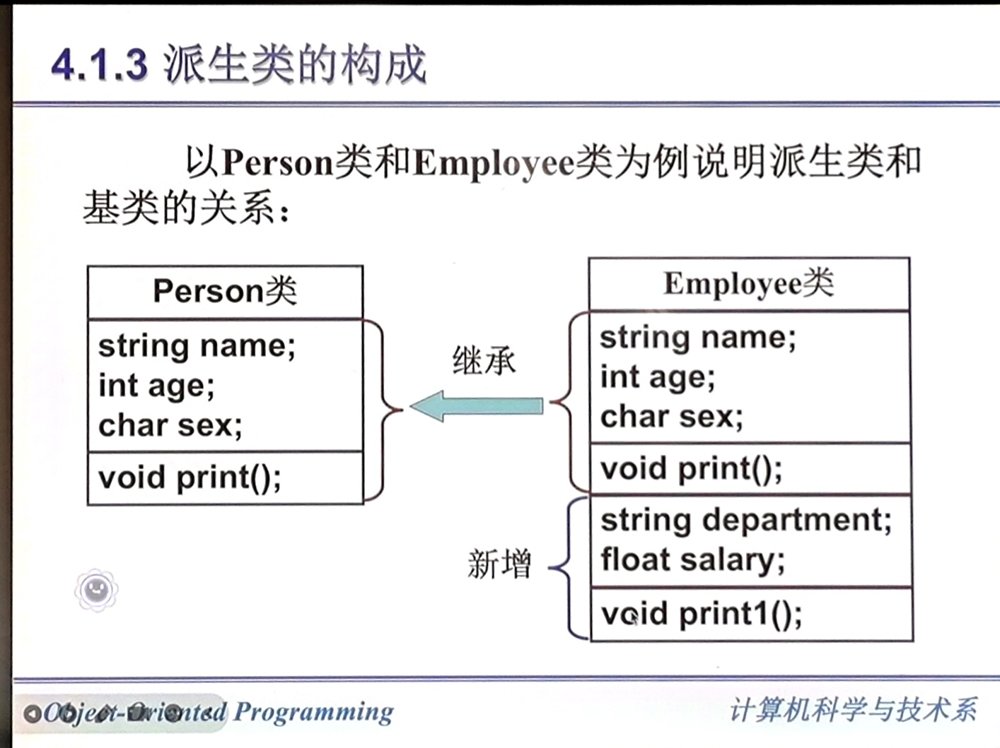
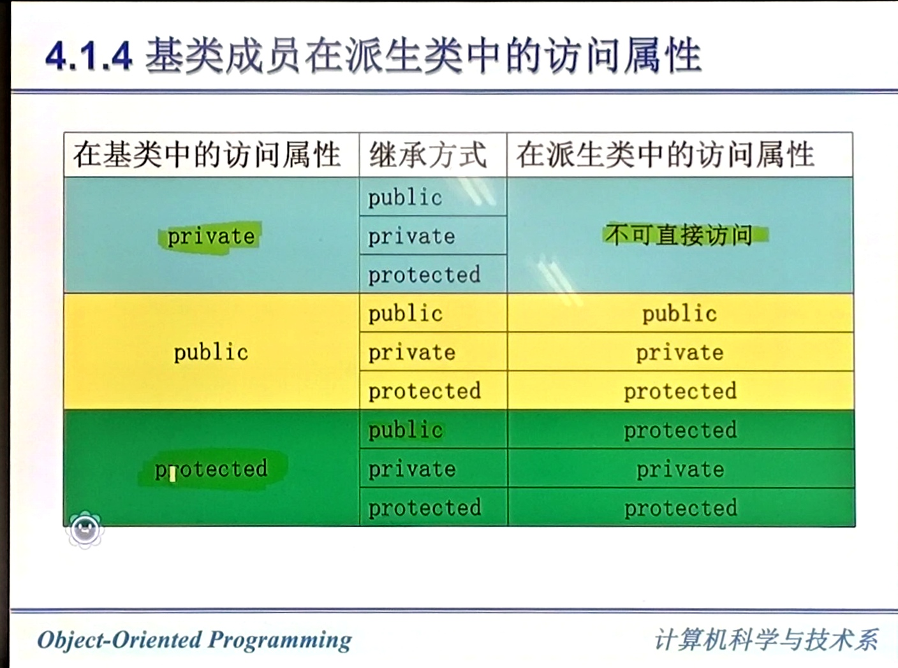
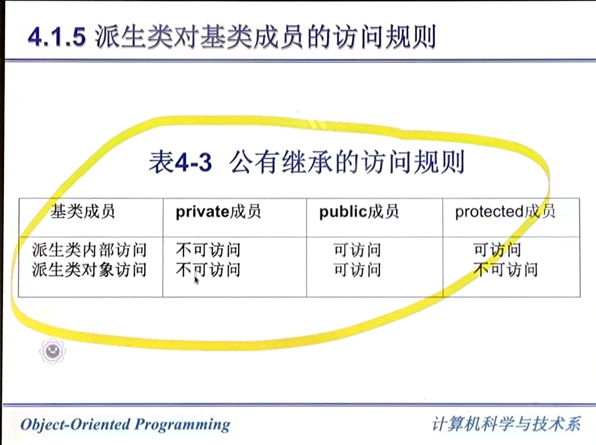
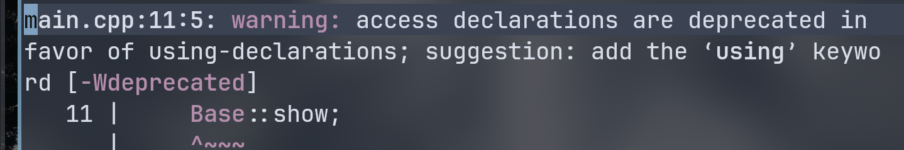

# 派生类和继承

## 派生类的概念
在c++中，类的相互关系主要可以分为三类：  


继承代表了 **is a** 关系：  

已有的类叫基类，新建的类叫派生类。  


### protect 修饰符
和 private 相似。但是在继承中，父类可以访问子类的 protect 成员，但是子类不能访问父类的 protect 成员。  
而 private 仅自己可以访问。  
详细看：[https://www.runoob.com/cplusplus/cpp-class-access-modifiers.html](https://www.runoob.com/cplusplus/cpp-class-access-modifiers.html)  
### 继承格式
``` cpp
// 基类
class Shape 
{
   public:
      void setWidth(int w)
      {
         width = w;
      }
      void setHeight(int h)
      {
         height = h;
      }
   protected:
      int width;
      int height;
};
 
// 派生类
class Rectangle: public Shape
{
   public:
      int getArea()
      { 
         return (width * height); 
      }
};
```

### 派生类的构成
``` cpp
class 派生类名: 继承方式 基类名{
    // 派生类新增的数据成员和成员函数
};
```

``` cpp
class employee: public person{}; // 公有继承
class employee: private person{};// 私有继承
class employee: protect person{};// 保护继承
```

- 如果没有显式定义继承方式，系统默认为 private。  

### 基类成员在派生类中的访问属性
  

  

在基类中的访问属性为 private，在派生类中访问属性还是不可访问。所以有 protected 访问属性。  
  

内部访问：由派生类中新增成员对基类继承来的成员的访问。  
对象访问：在派生类外部，通过派生类的对象对从基类继承的成员的访问。  
``` c
#include <iostream>

class Base {
protected:
    int y = 20;

public:
    int x = 10;
};

class Derived : public Base {
public:
    void show() {
        std::cout << x << std::endl; // 内部访问：派生类成员函数访问继承成员
        std::cout << y << std::endl; // 内部访问：protected 也可访问
    }
};

int main() {
    Derived d;
    d.show();                      // 调用内部访问
    std::cout << d.x << std::endl; // 外部访问：通过对象访问继承的 public 成员
    // std::cout << d.y << std::endl; // 外部访问失败：protected
}
```


        

例题：
派生类能否直接访问基类的私有成员？若否，应如何实现？  
派生类不能直接访问基类的私有成员，但是可以通过基类提供的公有成员函数间接地访问基类的私有成员。  


#### 公有继承的访问规则

  


## 派生类的构造函数和析构函数

派生类对象的构造与析构顺序：  

构造顺序：先基类，后派生类。若有成员对象，先构造成员对象，再执行派生类构造函数体。  
析构顺序：先派生类，后基类。成员对象析构在派生类析构函数体执行完之后、基类析构之前。  

简短示例：
``` c
#include <iostream>

struct Member {
    Member() { std::cout << "Member()\n"; }
    ~Member() { std::cout << "~Member()\n"; }
};

struct Base {
    Base() { std::cout << "Base()\n"; }
    ~Base() { std::cout << "~Base()\n"; }
};

struct Derived : public Base {
    Member m;
    Derived() { std::cout << "Derived()\n"; }
    ~Derived() { std::cout << "~Derived()\n"; }
};

int main() {
    Derived d;
}
```
输出：
```
Base()
Member()
Derived()
~Derived()
~Member()
~Base()
```

时序图（构造 / 析构）：
```
构造：Base() -> Member() -> Derived()
析构：~Derived() -> ~Member() -> ~Base()
```

派生类构造函数：
``` cpp
派生类名(参数表):基类名(参数表)
{
}
```
派生类的构造函数定义可以定义在类的外部。此时类中不包括基类构造函数名及其参数表。只在类外定义构造函数时才将它列出。    

示例：
``` cpp
#include <iostream>

class Base {
public:
    Base(int v) { std::cout << "Base(" << v << ")\n"; }
};

class Derived : public Base {
public:
    Derived(int v); // 仅声明
};

Derived::Derived(int v) : Base(v) {
    std::cout << "Derived(" << v << ")\n";
}

int main() {
    Derived d(5);
}
```

简化版本（基类默认构造）：
``` cpp
#include <iostream>

class Base {
public:
    Base() { std::cout << "Base()\n"; }
};

class Derived : public Base {
public:
    Derived();
};

Derived::Derived() {
    std::cout << "Derived()\n";
}

int main() {
    Derived d;
}
```

基类的构造函数使用默认构造函数或**不带参数的构造函数**时，在派生类中定义构造函数时可以省略前导（初始化成员表），也可以不定义构造函数。  

当基类没有默认构造函数，它所有的派生类都被必须定义构造函数。  

含有对象成员的派生类的构造函数：  
``` cpp
派生类名(参数总表):基类名(参数表1), 对象成员名1(参数表1), ... , 对象成员名n(参数表n)
{
    // 派生类新增成员的初始化语句
}
```

构造函数的执行顺序：    
1. 调用基类的构造函数  
2. 调用内嵌对象成员的构造函数（有多个对象成员时，调用顺序由它们在类中声明的顺序确定）  
3. 派生类的构造函数体中的内容  

示例（包含这 3 种方式）：
``` cpp
#include <iostream>

class Base {
public:
    Base(int v) { std::cout << "Base(" << v << ")\n"; }
};

class Member {
public:
    Member(int v) { std::cout << "Member(" << v << ")\n"; }
};

class Derived : public Base {
public:
    Member m;
    Derived(int v, int mv) : Base(v), m(mv) {
        std::cout << "Derived(" << v << ")\n";
    }
};

int main() {
    Derived d(1, 2);
}
```

输出顺序：
```
Base(1)
Member(2)
Derived(1)
```

撤销对象时，析构函数的调用顺序与构造函数调用的顺序相反。  
派生类的基类也是一个派生类，每个派生类只需要调用其直接基类的构造函数的构造函数，以此类推上溯。  
调用内嵌对象成员构造函数的顺序由它们在类中声明的顺序确定。  
## 调整基类成员在派生类中的访问属性
### 同名成员
C++ 允许派生类成员与基类成员名字相同，称为派生类成员覆盖了基类的同名成员。在派生类中使用这个名字意味着访问在派生类中说明的成员。  
为了在派生类中使用基类的同名成员，必须在该成员名字前加上基类名和作用域标识符`::`。  

示例：
``` cpp
#include <iostream>

class Base {
public:
    int value = 10;
    void show() { std::cout << "Base::value=" << value << "\n"; }
};

class Derived : public Base {
public:
    // 与 Base::value 同名，覆盖基类成员
    int value = 20;
    // 覆盖基类同名函数
    void show() { std::cout << "Derived::value=" << value << "\n"; }
    void showBoth() {
        // 默认访问派生类成员
        std::cout << "Derived::value=" << value << "\n";
        // 使用作用域限定访问基类成员
        std::cout << "Base::value=" << Base::value << "\n";
        // 调用基类同名函数
        Base::show();
    }
};

int main() {
    Derived d;
    d.show();
    d.showBoth();
}
```
输出示例：
```
Derived::value=20
Derived::value=20
Base::value=10
Base::value=10
```


``` cpp
#include <iostream>

class X
{
  public:
    int num;
};

class Y : private X
{
  public:
    int num;
};

int main()
{
    Y obj;
    std::cout << obj.num << std::endl;
    std::cout << obj.X::num << std::endl; // 报错：无法访问（'X' is a private member of 'X'）
    std::cout << obj.Y::num << std::endl;
}
```

### 访问声明
对于私有继承，基类的公有成员变为派生类的私有成员。外界不能利用派生类的对象调用，只能通过调用派生类的成员函数来间接访问。  
C++ 提供了访问声明的特殊机制，可个别调整基类的某些成员。  

示例（使用访问声明调整访问级别）：
``` cpp
#include <iostream>

class Base {
public:
    void show() { std::cout << "Base::show\n"; }
    int value = 42;
};

class Derived : private Base {
public:
    // 访问声明：把 Base::show 提升为 public
    using Base::show;
    // 访问声明：把 Base::value 提升为 public
    using Base::value;
    // 旧式访问声明（C++17 已移除，仅示例）
    Base::show;
    Base::value;
};

int main() {
    Derived d;
    // 通过访问声明公开的成员可直接访问
    d.show();
    std::cout << d.value << "\n";
}
```

访问声明中只含有不带类型和参数的函数名或变量名。  
```
A::print
```

- 不能对基类的私有成员使用访问声明。  
- C++11 之后，使用 `using` 声明（旧式写法已经在 C++ 17 弃用）




``` cpp
#include <iostream>

class Base
{
  public:
    void show()
    {
        std::cout << "Base::show\n";
    }
    int value = 42;
    void f()
    {
        std::cout << "f()" << std::endl;
    }
    void f(int n)
    {
        std::cout << n << std::endl;
    }

  protected:
};

class Derived : private Base
{
  public:
    using Base::value;
    using Base::f; // f() f(int n) 都会变成 public
};

int main()
{
    Derived d;
    // 都可以用
    d.f();
    d.f(2);
}
```
## 多重继承
派生类只有一个基类，这种派生方法称为单基派生或单继承  
当一个派生类具有多个基类时，这种派生方法称为多基派生或多继承。  

```cpp
class 派生类名: 继承方式1 基类名,.. 继承方式n 基类名
{
}
```

多重继承下的访问特性：
- 每个基类的成员访问级别由各自的继承方式决定（public/protected/private）。
- 若使用 public 继承，基类的 public/protected 成员在派生类中保持原有访问级别。
- 若使用 protected 继承，基类的 public/protected 成员在派生类中变为 protected。
- 若使用 private 继承，基类的 public/protected 成员在派生类中变为 private。
- 多个基类存在同名成员时，访问需使用作用域限定（如 `Base1::func`）。

示例（访问必须无二义性）：
``` cpp
#include <iostream>

class Base1 {
public:
    void show() { std::cout << "Base1::show\n"; }
};

class Base2 {
public:
    void show() { std::cout << "Base2::show\n"; }
};

class Derived : public Base1, public Base2 {
public:
    void test() {
        // show(); // 报错：二义性
        Base1::show();
        Base2::show();
    }
};

int main() {
    Derived d;
    d.test();
}
```

示例：
``` cpp
#include <iostream>

class A {
public:
    void showA() { std::cout << "A::showA\n"; }
};

class B {
public:
    void showB() { std::cout << "B::showB\n"; }
};

class C : public A, public B {
public:
    void showAll() {
        // 同时访问两个基类成员
        showA();
        showB();
    }
};

int main() {
    C c;
    c.showAll();
    // 也可以使用作用域限定访问基类成员
    c.A::showA();
    c.B::showB();
}
```

多重继承派生类的构造函数和析构函数:
```cpp
派生类名(参数总表):基类名1(参数表1), 基类名2(参数表2)...
{
    //派生类的初始化语句
}
```
各个基类的构造函数执行顺序由派生类中基类的声明顺序决定，与初始化列表中的书写顺序无关。  

为什么要引入虚基类：
- 解决菱形继承中“共同基类”被重复继承的问题，避免出现两份基类子对象。
- 统一共享同一个基类子对象，消除成员访问二义性与状态不一致。

菱形继承结构：
```
        Base
       /    \
    Left   Right
       \    /
      Derived
```

示例（菱形继承，使用虚基类）：
``` cpp
#include <iostream>

class Base {
public:
    int value = 0;
};

class Left : virtual public Base {
};

class Right : virtual public Base {
};

class Derived : public Left, public Right {
public:
    void set() {
        // 只有一份 Base 子对象，访问无二义性
        value = 10;
    }
};

int main() {
    Derived d;
    d.set();
    std::cout << d.value << "\n";
}
```

示例：
``` cpp
#include <iostream>

class A {
public:
    A() { std::cout << "A()\n"; }
};

class B {bas
public:
    B() { std::cout << "B()\n"; }
};

class C : public A, public B {
public:
    // 初始化列表里把 B 放前，但构造顺序仍按 A, B
    C() : B(), A() { std::cout << "C()\n"; }
};

int main() {
    C c;
}
```
输出示例：
```
A()
B()
C()
```

```
class 派生类名: virtual 继承方式 基类名
{
    // ..
}
```

示例（虚继承写法）：
``` cpp
#include <iostream>

class Base {
public:
    int value = 0;
};

class Left : virtual public Base {
};

class Right : virtual public Base {
};

class Derived : public Left, public Right {
public:
    void setValue(int v) { value = v; }
};

int main() {
    Derived d;
    d.setValue(5);
    std::cout << d.value << "\n";
}
```
输出示例：
```
5
```
正常情况，调用最近的父类。  
而在虚基类，最终的 derived 类构造函数需要调用最远构造函数，次级虽然写了，但是实际构造函数不会调用。    
virtual 顺序无关紧要。  

编译器通常会在派生类中插入一个虚基类指针（vbptr），指向一个虚基类表（vbtable），表中存储了虚基类子对象相对于该派生类的偏移量。  
这样，不论通过哪条继承路径访问虚基类成员，都能定位到唯一的共享实例，保证了统一性。  

---

例题：

什么是多继承？多继承时，构造函数和析构函数执行顺序是怎样的？  

答案：当一个派生类具有多个基类时，这种派生方法称为多继续。多重继承的够展示执行顺序与单继承的执行顺序相同，也是遵循先执行基类的构造函数，在执行对象成员的构造函数，最后执行派生类构造函数体的原则。处于同一层次的各个积累构造函数的执行顺序取决于声明派生类时所指定的各个积累的顺序，与派生类构造函中所定义的成员初始化列表中的各项顺序没有关系，析构函数的执行顺序则与构造函数的执行顺序相反。  

--- 

设置虚基类的目的是：

A. 简化程序 B. 消除二义性 C. 提高运行效率 D. 减少目标代码  

答案： B  

设置虚基类的目的是消除二义性。当一个派生类从两个或多个基类继承，而这些基类又有一个共同的基类时，派生类将有两个共同基类的副本的，这回导致二义性问题。即派生类的对象无法确定应该使用哪个共同基类的副本。通过设置虚基类可以确保派生类只有一个共同基类的副本，从而消除二义性。  

---
在类的派生中派生中为何要引入虚基类？虚基类构造函数的调用顺序是如何规定的？  

因为菱形继承的二义性。  
虚基类的初始化与一般的多继承初始化在语法上是一样的，但构造函数的调用顺序不同。遵循**深度优先、从左到右**。  
当存在多个虚基类时，构造顺序取决于它们在继承图中的位置：  

- 从最派生类开始，沿着继承路径向下探索。  
- 深度优先：先探索完一条分支到底部，再回溯探索下一条分支。  
- 从左到右：在继承列表和每个基类的继承列表中，都按声明的顺序从左到右处理。  
- 只构造一次：如果某个虚基类已经被构造过，则跳过。  
注意：这个顺序是在编译时确定的，并且与初始化列表中书写的顺序无关。  

## 基类和派生类对象之间的赋值兼容关系
需要基类对象的任何地方都可以使用公有派生类的对象来替代。  
这样共有派生类实际上就具备了基类的所有特性。凡基类能解决的问题，公有派生类也能解决。  
核心规则为：**派生类对象可以向基类赋值，但基类对象不能向派生类赋值。**   

```cpp
class Base
{

};

class Derived:public Base
{
};
```

可以用派生类的对象给基类对象赋值。  
``` cpp

```

用派生类的对象来初始化基类的引用。  
``` cpp
```

可以把派生类对象的地址赋值给基类的指针。  
``` cpp
Dervied d;
Base *btr = &d;
```

可以把指向派生类对象的指针赋值给指向基类对象的指针。  
``` cpp
Derived *dptr;
Base *bptr = dpter;
```

如果函数形参是基类对象或基类对象的引用，在调用函数时可以用派生类对象作为实参。  

**说明**：  
1. 声明为指向基类对象的指针可以指向它的公有派生对象，但不允许指向私有派生的对象。  
2. 声明为指向基类对象的指针，当指向公有派生类对象时，只能直接访问派生类中从基类继承来的成员，而不能直接访问公有派生类中定义的成员。  

## 编译器简单继承权限实现
一种编译器权限实现：  
编译器在解析代码时，会为每个类构建内部的符号表。当处理派生类时，编译器会进行“权限降级”计算。  
对于基类的每个成员，编译器记录其实际权限（$P_{base}$）。  
对于派生类的继承方式，编译器记录继承修饰符（$M_{inh}$)。  
派生类中该成员的最终暴露权限 ($P_{derived} = \min(P_{base}, M_{inh}$)（权限级别：public > protected > private）    

也就是这样实现：
``` cpp
EffectiveAccess = min(BaseMemberAccess, InheritanceAccess);
// 规则：public < protected < private
```
## 应用举例


## 参考资料
1. [知乎：轻松理解c++中的继承与派生](https://zhuanlan.zhihu.com/p/603637625)  
