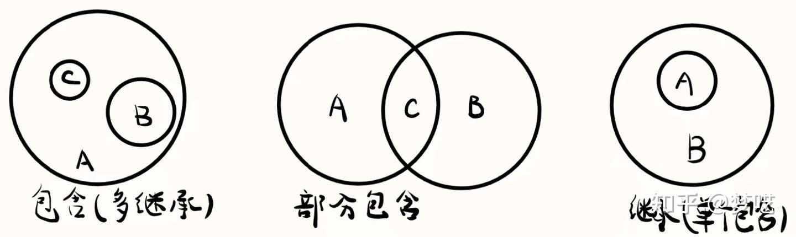
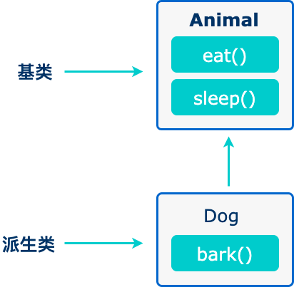
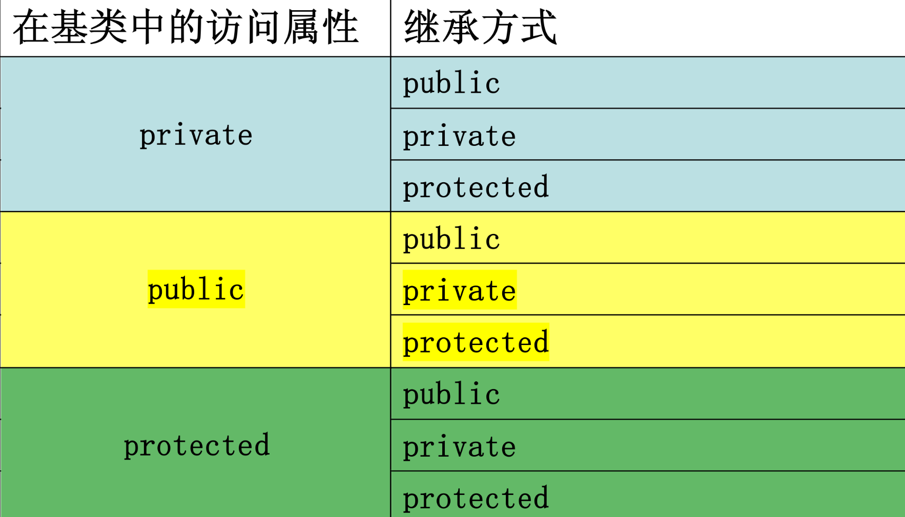
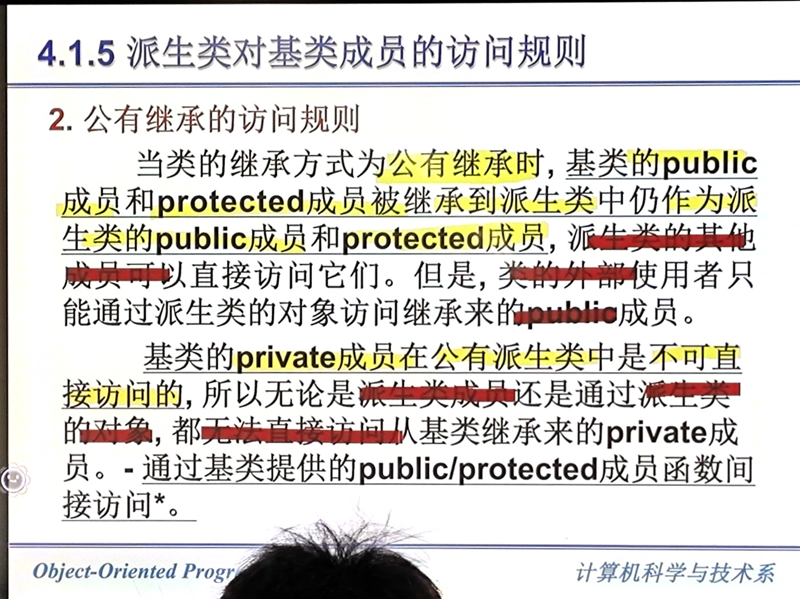

# 派生类和继承

## 派生类的概念
在c++中，类的相互关系主要可以分为三类：  


继承代表了 **is a** 关系：  

已有的类叫基类，新建的类叫派生类。  


### protect 修饰符
和 private 相似。但是在继承中，父类可以访问子类的 protect 成员，但是子类不能访问父类的 protect 成员。  
而 private 仅自己可以访问。  
详细看：[https://www.runoob.com/cplusplus/cpp-class-access-modifiers.html](https://www.runoob.com/cplusplus/cpp-class-access-modifiers.html)  
### 继承格式
``` cpp
// 基类
class Shape 
{
   public:
      void setWidth(int w)
      {
         width = w;
      }
      void setHeight(int h)
      {
         height = h;
      }
   protected:
      int width;
      int height;
};
 
// 派生类
class Rectangle: public Shape
{
   public:
      int getArea()
      { 
         return (width * height); 
      }
};
```

### 派生类的构成
``` cpp
class 派生类名: 继承方式 基类名{
    // 派生类新增的数据成员和成员函数
};
```

``` cpp
class employee: public person{}; // 公有继承
class employee: private person{};// 私有继承
class employee: protect person{};// 保护继承
```

- 如果没有显式定义继承方式，系统默认为 private。  

### 基类成员在派生类中的访问属性
  

内部访问：由派生类中新增成员对基类继承来的成员的访问。  
对象访问：在派生类外部，通过派生类的对象对从基类继承的成员的访问。  

#### 公有继承的访问规则

  


## 派生类的构造函数和析构函数

## 调整基类成员在派生类中的访问属性

## 多重继承

## 基类和派生类对象之间的赋值兼容关系

## 参考资料
1. [知乎：轻松理解c++中的继承与派生](https://zhuanlan.zhihu.com/p/603637625)  
