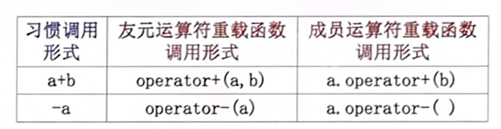
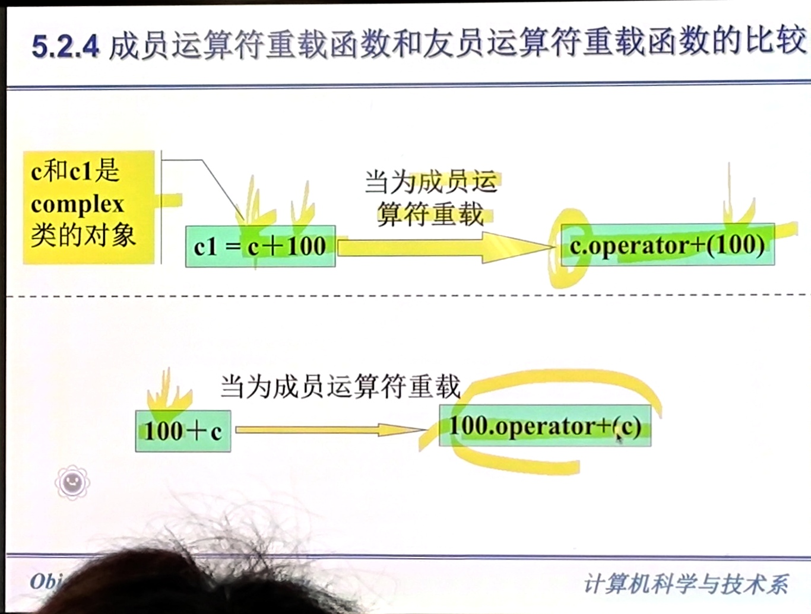
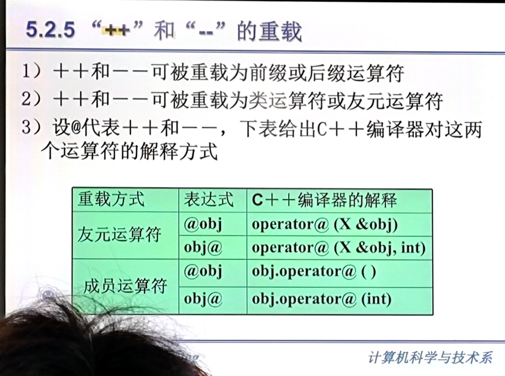
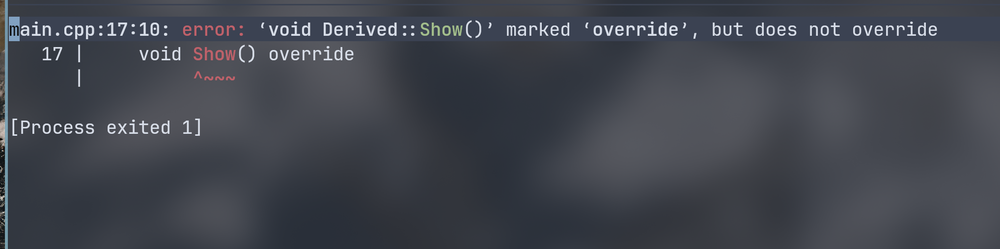

# 多态性
多态性就是不同对象收到相同的消息时，产生不同的动作。用一个名字定义不同的函数。这些函数执行不同但又类似的操作。  
## 编译时的多态性和运行时的多态性
联编(binding)  
## 运算符重载
默认情况下，运算符只对基本类型有效。  
`operator` C++ 关键字，经常和 C++ 中的运算符联用。表示一个运算符函数名：
`operator+` 重载 `+` 运算符。  

```cpp
class Complex{
public:
    double real, image; // 都是 public
    Complex(double r = 0.0, double i = 0.0){
        real = r;
        image = i;
    }
};
```

对上述自定义数据类型，要使用加法运算需要用新的参数类型重载 operator+。  

``` cpp
Complex operator+(Complex a, Complex b){
    Complex tmp;
    tmp.real = a.real + b.real;  // 所以才能被直接访问
    tmp.image = a.image + b.image;
    return tmp;
}
```
系统遇到 `z = x + y`  时，会转换成：`z = operator+(x,y)`。   

为了确保封装性，可以用友元。  
``` cpp
class Complex
{

    double real, image;

  public:
    Complex(double r = 0.0, double i = 0.0)
    {
        real = r;
        image = i;
    }
    friend Complex operator+(Complex a, Complex b);
};

Complex operator+(Complex a, Complex b)
{
    Complex tmp;
    tmp.real = a.real + b.real;
    tmp.image = a.image + b.image;
    return tmp;
}
```

### 不能重载的运算符

以下 6 个运算符**不能**重载：

| 运算符 | 名称 | 原因 |
|--------|------|------|
| `::` | 作用域解析运算符 | 左操作数是类型名，不是表达式 |
| `.`  | 成员访问运算符 | 用于访问类成员，重载会破坏语法安全性 |
| `.*` | 成员指针访问运算符 | 语法特殊性，无法在重载中保持语义 |
| `?:` | 三元条件运算符 | 内建短路求值规则，无法通过函数模拟 |
| `sizeof` | 对象大小运算符 | 参数是类型而非表达式，编译期求值 |
| `typeid` | 类型信息运算符 | 返回 `std::type_info`，与 RTTI 绑定 |

此外，`#` 和 `##` 是**预处理运算符**，作用于预处理阶段，不属于 C++ 运算符重载的讨论范畴。

```cpp
// 编译错误：不能重载 ::
int operator::(int a, int b);

// 编译错误：不能重载 .
int operator.(A& obj);

// 编译错误：不能重载 ?:
int operator?:(bool cond, int a, int b);
```

运算符重载的参数，至少有一个是类对象（或类对象的引用），即：运算符重载函数的参数不能全部是 C++ 标准类型。  
``` cpp
int operator+(int x, int y)
{
    return x+y;
}
```

友元重载运算符  
在类内声明 firend ，在类外定义。  

双目运算符重载。  

单目运算符重载。
只有一个操作数如 `-a` `&a`。  

``` cpp
class Coord
{
  private:
    int x, y;

  public:
    Coord(int a, int b)
    {
        x = a;
        y = b;
    }
    friend Coord operator-(const Coord &a);
    friend Coord operator++(Coord &a);
};

Coord operator-(const Coord &a)
{
    return Coord(-a.x, -a.y);
}

Coord operator++(Coord &a)
{
    ++a.x;
    ++a.y;
    return a; // 实现链式调用
}
```

### `operator++` 前置调用和后置调用
为了区分前后置运算符，后置自增运算时需要添加一个类型为 int 的空置形参。  
``` cpp
struct MyInt {
  int x;

  // 前置，对应 ++a
  MyInt &operator++() {
    x++;
    return *this;
  }

  // 后置，对应 a++
  MyInt operator++(int) {
    MyInt tmp;
    tmp.x = x;
    x++;
    return tmp;
  }
};
```

### 成员运算符重载函数
``` cpp
class X{
    函数类型 operator 运算符(形参表);
};

函数类型 X::operator 运算符(形参表)
{
}
```

成员运算符重载函数的形参表只有一个参数。它作为运算符的右操作数。另一个操作数（左操作数）是隐含的。  
调用方式：  
``` cpp
aa @ bb;
aa.operator@(bb);
```

例：  
``` cpp
A3 - A1 + A2; => A3 = A1.operator(A2);
```


``` cpp
class Coord
{
  private:
    int x, y;
  public:
    Coord operator-(const Coord &a);
    Coord& operator++();
};

Coord Coord::operator-(const Coord &a)
{
    Coord tmp;
    tmp.x = this->x + a.x;
    tmp.y = this->y + a.y;
    return tmp;
}

Coord& Coord::operator++()
{
    ++x;
    ++y;
    return *this;
}
```

### 比较


C++ 大部分运算符即可以作为成员运算符重载函数，又可以说明为友元运算符重载函数。  



只能用成员运算符重载：
`=`赋值运算符 `()`函数调用运算符 `[]`下标运算符 `->` 指向运算符  




obj@ 还要加一个 int 参数，以作为区分。  

``` cpp
X operator++(X &op, int)
{
    op.i1++;
    op.i2++;
    op.i3++;
    return op;
}

X obj1, obj2;
obj2 = obj1++;
```

这个代码是有问题的，return 的是自增过的值，实际要的是自增前的值。  
应该定义一个临时变量：
``` cpp
X operator++(X &op, int)
{
    X tmp(op);
    op.i1++;
    op.i2++;
    op.i3++;
    return tmp;
}
```

**完整示例：友元重载前置与后置 `++`**

```cpp
#include <iostream>

class X
{
  public:
    X() : i1(0), i2(0), i3(0) {}

    // 前置 ++：成员函数，返回引用支持链式调用
    X &operator++()
    {
        std::cout << "前置++" << std::endl;
        ++i1;
        ++i2;
        ++i3;
        return *this;
    }

    int i1, i2, i3;

    // 后置 ++：友元函数，int 参数仅用于区分前后置
    friend X operator++(X &op, int);

    void print() const
    {
        std::cout << i1 << " " << i2 << " " << i3 << std::endl;
    }
};

// 后置 ++：返回自增前的副本
X operator++(X &op, int)
{
    X tmp(op);      // 拷贝当前状态
    op.i1++;
    op.i2++;
    op.i3++;
    return tmp;     // 返回旧值
}

int main()
{
    X a;
    ++a;            // 前置，a 变为 (1,1,1)
    a++;            // 后置，a 变为 (2,2,2)
    ++++++a;        // 前置支持链式：等价于 ++(++(++a))

    // ++(++a++)++; // 编译错误！
    // 后置 ++ 的参数是 X &（非 const 左值引用），
    // 而 a++ 返回的是临时对象（右值），无法绑定到左值引用
    return 0;
}
```

> 前置 `++` 返回引用（`X &`），支持链式 `++++++a`；后置 `++` 返回值（`X`），且参数为 `X &`，**临时对象（右值）不能绑定到非 const 左值引用**，因此 `++(++a++)++` 无法编译。

### 赋值运算符 `=` 的重载：  
系统自动实现了一个默认的重载的赋值运算符。  
```
X & X::operator=(const X & tmp)
{
}
```

`a1=a2` 默认赋值运算符重载会把 a2 所有的数据成员赋值给 a1。（浅拷贝）  
在拷贝指针的时候可能会出现内存泄漏（原本指针存储的地址被改变，原本的分配内存没有指针指向出现指针悬挂。甚至在析构也不会销毁该内存空间，也就是出现内存泄漏）。  
所以需要对赋值运算符做重新重载，对指针变量做额外操作。  

`p2 = p1` => `p2.operator=(p1)`  

返回一个 `return *this` 可以支持链式调用如：`p2 = p1 = 3` 这类。  

**示例：模拟 String 类的赋值运算符重载**

```cpp
#include <iostream>
#include <cstring>

class String
{
  private:
    char *str;       // 指向堆内存的指针

  public:
    // 构造函数：从 const char* 初始化
    String(const char *s = "")
    {
        str = new char[strlen(s) + 1];
        strcpy(str, s);
    }

    // 拷贝构造函数（深拷贝）
    String(const String &other)
    {
        str = new char[strlen(other.str) + 1];
        strcpy(str, other.str);
    }

    // 重载赋值运算符 =（深拷贝）
    String &operator=(const String &other)
    {
        // 1. 防止自赋值：s = s 的情况
        if (this == &other)
            return *this;

        // 2. 释放原有内存，避免内存泄漏
        delete[] str;

        // 3. 分配新内存并拷贝数据
        str = new char[strlen(other.str) + 1];
        strcpy(str, other.str);

        // 4. 返回 *this 支持链式调用：s1 = s2 = s3
        return *this;
    }

    void print() const
    {
        std::cout << str << std::endl;
    }

    ~String()
    {
        delete[] str;
    }
};

int main()
{
    String s1("hello");
    String s2("world");
    String s3;

    s3 = s1;             // 等价于 s3.operator=(s1)
    s1 = s1;             // 自赋值，被 if (this == &other) 拦截
    s3 = s2 = s1;        // 链式调用，等价于 s3.operator=(s2.operator=(s1))

    s3.print();          // hello
    return 0;
}
```

> **要点**：赋值运算符重载必须处理三个问题——① 防止自赋值（`this == &other`）；② 释放旧资源防止内存泄漏；③ 返回 `*this`（引用）支持链式调用。如果类中有指向堆内存的指针成员，默认的浅拷贝会导致两个对象指向同一块内存，析构时造成重复释放（double free）。

### 下标运算符`[]` 的重载
``` cpp
int &X:operator[](int bi)
{
}
```
注意检查下标越界。  
## 类型转换
类类型与系统预定义类型间的转换。  
转换构造函数：具有将参数类型转换为该类类型的功能。  

```cpp
class Complex
{
  public:
    double real, imag;

    // 默认构造函数
    Complex() : real(0), imag(0) {}

    // 转换构造函数：double → Complex
    Complex(double r) : real(r), imag(0) {}

    // 普通构造函数
    Complex(double r, double i) : real(r), imag(i) {}
};

int main()
{
    Complex c1;           // 默认构造
    Complex c2(3.14);     // 转换构造：3.14 → Complex(3.14, 0)
    Complex c3 = 2.718;   // 隐式转换构造，等价于 Complex c3(2.718)

    c1 = 5.0;   // 隐式转换：5.0 → Complex(5.0, 0)，再赋值给 c1
    c2 = c3;    // 普通赋值（同类型）

    return 0;
}
```

> 构造函数 `Complex(double r)` 既是普通构造函数，也是**转换构造函数**——它能把 `double` 类型隐式转换为 `Complex` 类型。如果只想允许显式转换，加 `explicit` 关键字：`explicit Complex(double r)`。
有符合的构造函数就可以直接赋值给一个对象，就像上图一样。  

类型转换函数：
``` cpp
operator 目的类型();
```

目的类型（既要转换成的类型），既可以是自定义的类型也可以是预定义的类型。  

**示例：类类型 → 预定义类型的转换**

```cpp
#include <iostream>

class Complex
{
  public:
    double real, imag;

    Complex(double r = 0, double i = 0) : real(r), imag(i) {}

    // 类型转换函数：Complex → double（返回模长）
    operator double() const
    {
        return real; // 简单返回实部，实际可返回 sqrt(real*real + imag*imag)
    }

    // 类型转换函数：Complex → int
    operator int() const
    {
        return static_cast<int>(real);
    }
};

int main()
{
    Complex c(3.14, 2.71);

    double d = c;         // 隐式调用 operator double()，d = 3.14
    int    n = c;         // 隐式调用 operator int()，    n = 3

    std::cout << d << std::endl;  // 3.14
    std::cout << n << std::endl;  // 3

    return 0;
}
```

> 类型转换函数没有参数也没有返回值类型（返回值由 `operator` 后的类型隐含指定），通常声明为 `const`。如果不想发生隐式转换，C++11 起可加 `explicit`：`explicit operator double() const`。

## 虚函数

``` cpp
#include <iostream>

class Base
{
  public:
    void show()
    {
        std::cout << "基类" << std::endl;
    }

  private:
};

class Derived : public Base
{
  public:
    void show()
    {
        std::cout << "派生类" << std::endl;
    }

  private:
};
int main(int argc, char *argv[])
{
    Base a, *ptr;
    Derived b;
    ptr = &a;
    ptr->show();
    ptr = &b;
    ptr->show();
    return 0;
}
```

输出:
```
基类
基类
```
没有虚函数，用基类指针指向派生类只能调用基类的同名函数。  

要能调用派生类的虚函数，基类要有同名的虚函数。  

基类指针指向派生类对象的时候，原本基类指针不能访问派生类的成员。如果在基类定义了虚函数，派生类按照规则写了**同名函数**就可以访问派生类的同名函数了。  
要求：函数名，返回类型和参数个数、类型、顺序都要一模一样。  

(满足赋值兼容规则的指针，引用型的返回类型也可以)  

``` cpp
#include <iostream>

class Base
{
  public:
    virtual void show()  // 添加了 virtual 关键字
    {
        std::cout << "基类" << std::endl;
    }

  private:
};

class Derived : public Base
{
  public:
    void show()
    {
        std::cout << "派生类" << std::endl;
    }

  private:
};
int main(int argc, char *argv[])
{
    Base a, *ptr;
    Derived b;
    ptr = &a;
    ptr->show();
    ptr = &b;
    ptr->show();
    return 0;
}
```

输出，如下。此时基类指针指向派生类后，访问派生类成员同名虚函数，可以调用子类的虚函数。  
```
基类
派生类
```

也可以在派生类的虚函数后面加上 `override`:
``` cpp
void show() override
{
    std::cout << "派生类" << std::endl;
}
```

这样对于笔误，比如写成 Show 会有报错：

  

这样我们就知道我们重写函数写错了，回去修改，避免了很多莫名其妙的问题。  

**综合示例：多态战斗系统**

```cpp
#include <iostream>

// 基类：角色
class Character
{
  protected:
    std::string name;
    int hp;

  public:
    Character(const std::string &n, int h) : name(n), hp(h) {}

    virtual void attack()  = 0;   // 纯虚函数，攻击
    virtual void defend()  = 0;   // 纯虚函数，防御
    virtual ~Character() {}       // 虚析构
};

// 战士：普攻高，防御时举盾减免伤害
class Warrior : public Character
{
  public:
    Warrior() : Character("战士", 150) {}
    void attack() override { std::cout << name << " 挥剑猛砍！" << std::endl; }
    void defend() override { std::cout << name << " 举盾格挡！" << std::endl; }
};

// 法师：远程魔法攻击，防御时开元素护盾
class Mage : public Character
{
  public:
    Mage() : Character("法师", 80) {}
    void attack() override { std::cout << name << " 吟唱火球术！" << std::endl; }
    void defend() override { std::cout << name << " 张开寒冰护盾！" << std::endl; }
};

// 刺客：高暴击，防御时闪避
class Assassin : public Character
{
  public:
    Assassin() : Character("刺客", 100) {}
    void attack() override { std::cout << name << " 暗影背刺！" << std::endl; }
    void defend() override { std::cout << name << " 烟雾闪避！" << std::endl; }
};

int main()
{
    Character *team[3] = { new Warrior(), new Mage(), new Assassin() };

    // 多态：同一接口，不同行为
    for (auto &c : team)
    {
        c->attack();   // 各自不同的攻击方式
        c->defend();   // 各自不同的防御方式
        delete c;
    }
    return 0;
}
```

> 三个派生类通过重写 `attack()` 和 `defend()` 实现了各自的战斗风格。`main` 中用基类指针统一遍历，无需关心具体是哪个角色——这就是多态的核心价值。  


若类内声明类外定义，在类内声明加 `virtual` 即可。  
派生类加 `virtual` 可有可无，**而 `override` 建议写**。  

### 虚析构函数  
如果基类的析构函数不是虚函数，用基类指针 `delete` 派生类对象时，**只会调用基类的析构函数**，派生类的析构函数不会被执行——导致派生类中分配的资源无法释放（内存泄漏）。

```cpp
// 问题演示
class Base
{
  public:
    ~Base() { std::cout << "~Base()" << std::endl; }  // 非虚析构
};

class Derived : public Base
{
    int *data;
  public:
    Derived() : data(new int[100]) {}
    ~Derived() { delete[] data; std::cout << "~Derived()" << std::endl; }
};

Base *p = new Derived();
delete p;  // 只调用了 ~Base()，Derived 中的 data 泄漏！
// 输出：~Base()
```

**正确做法**：基类析构函数加 `virtual`。

```cpp
class Base
{
  public:
    virtual ~Base() { std::cout << "~Base()" << std::endl; }
};
// 此时 delete p 会先调 ~Derived()，再调 ~Base()
// 输出：~Derived()  \n  ~Base()
```

**简单规则**：只要一个类被设计为多态基类（有虚函数），析构函数就应该声明为 `virtual`。不打算作为基类的普通类则不需要。


### 虚函数与重载函数的关系

| 虚函数                         | 同名成员                           | 重载                                           |
|--------------------------------|------------------------------------|------------------------------------------------|
| 在基类和派生类定义了同一个函数 | 在基类和派生类定义了同一个函数     | 重载是在同样作用域里的同名函数，但是参数不一样 |
| 基类的指针想要访问派生类的成员                       | 派生类的对象无法再访问基类同名函数 |                                                |


虚函数和同名成员的覆盖可能同时发生。（？）  

### 纯虚函数
``` cpp
virtual 函数类型 函数名(参数表)=0;
virtual float area()=0; // 在基类的虚函数定义 = 0，变成纯虚函数，避免异常调用。
```


定义纯虚函数说明，该函数必须要重写该函数，不然无法实现该方法。  
如果一个类至少有一个纯虚函数,那么这个类是抽象类。  


## 应用
