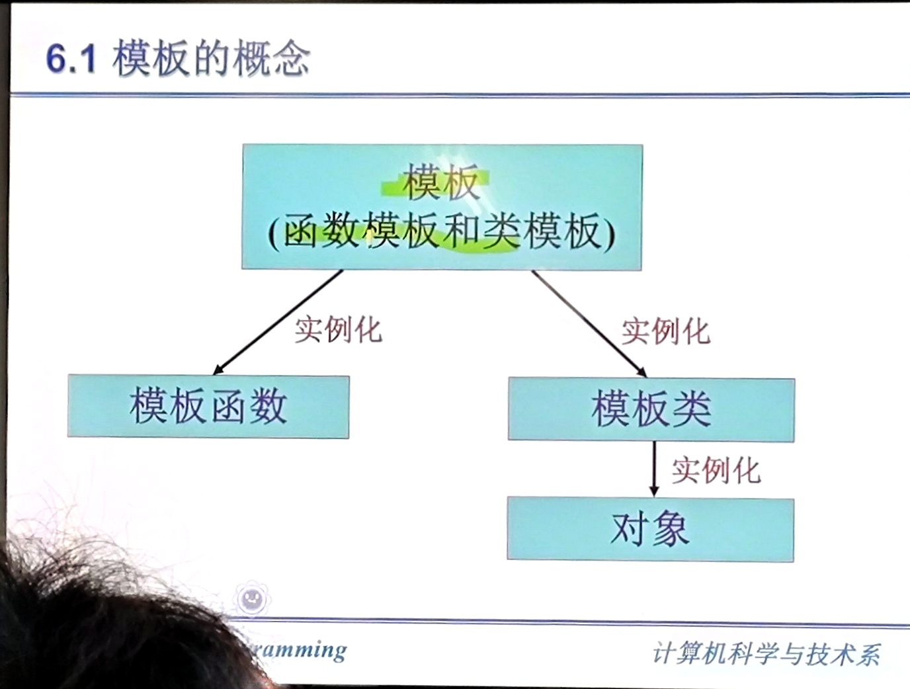
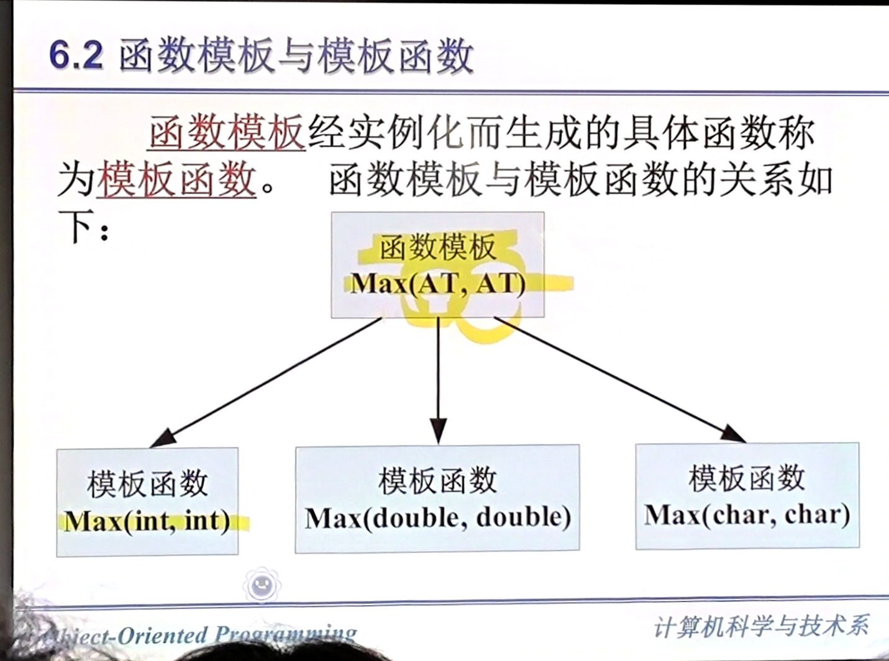
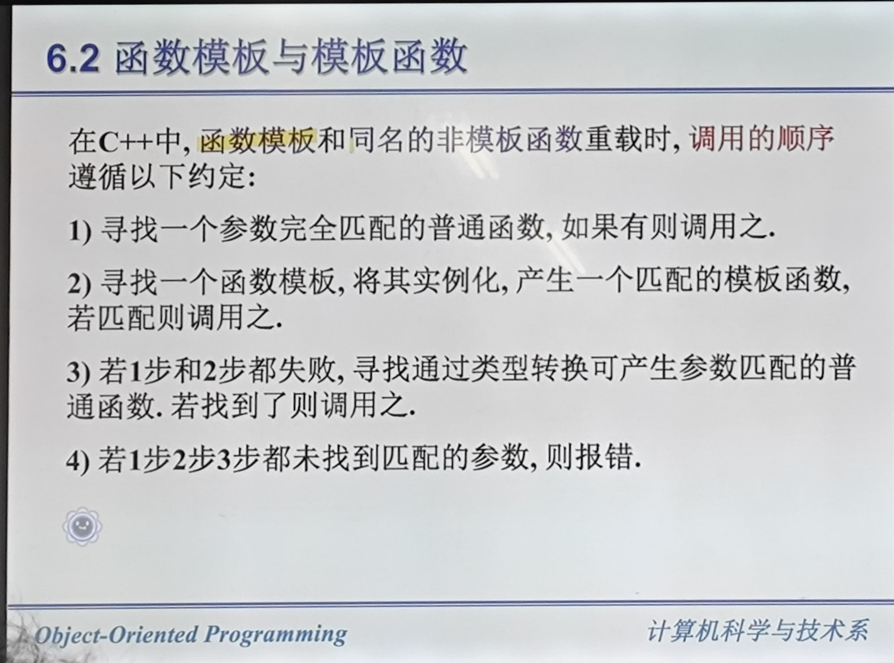
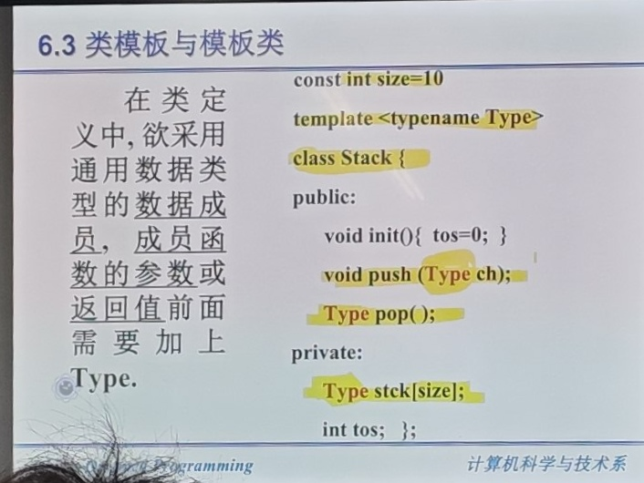
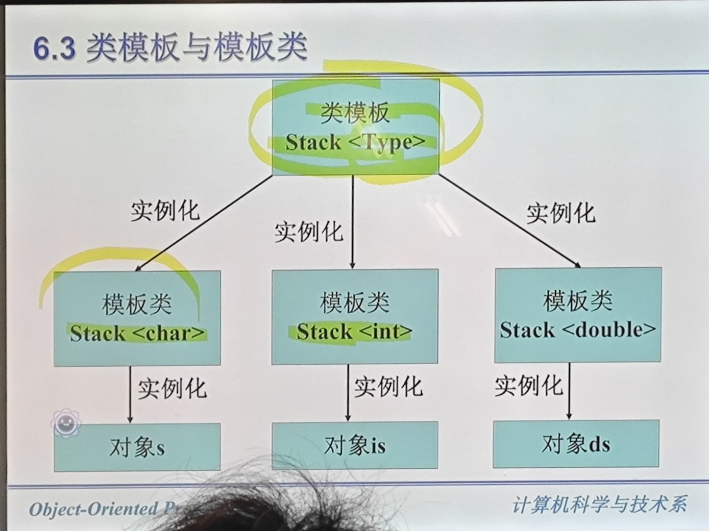
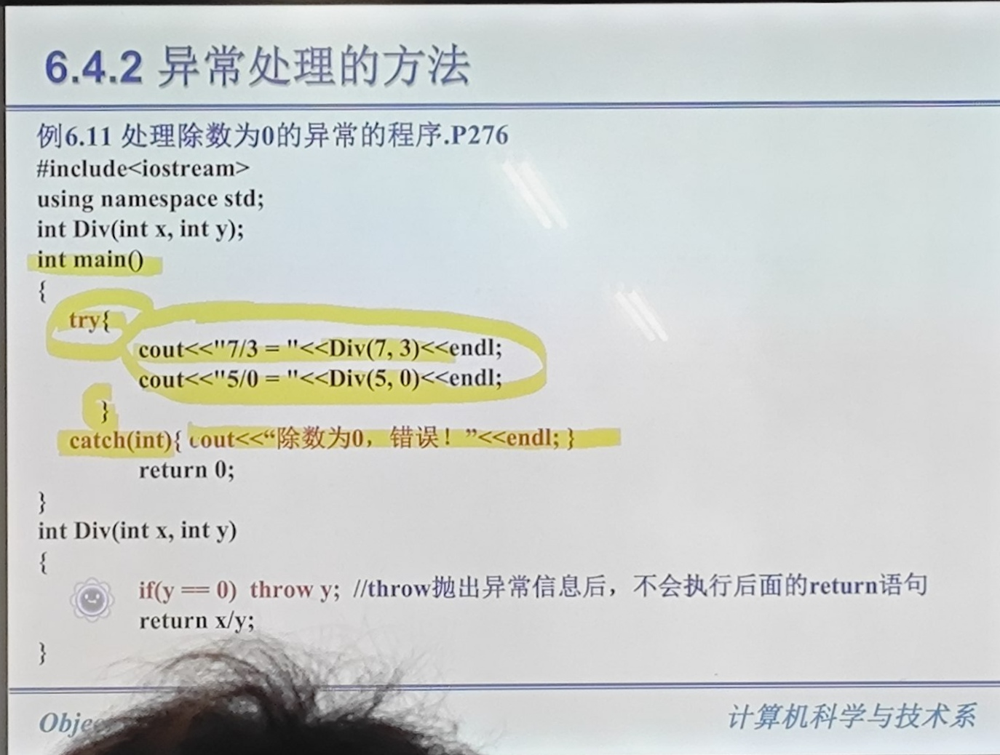
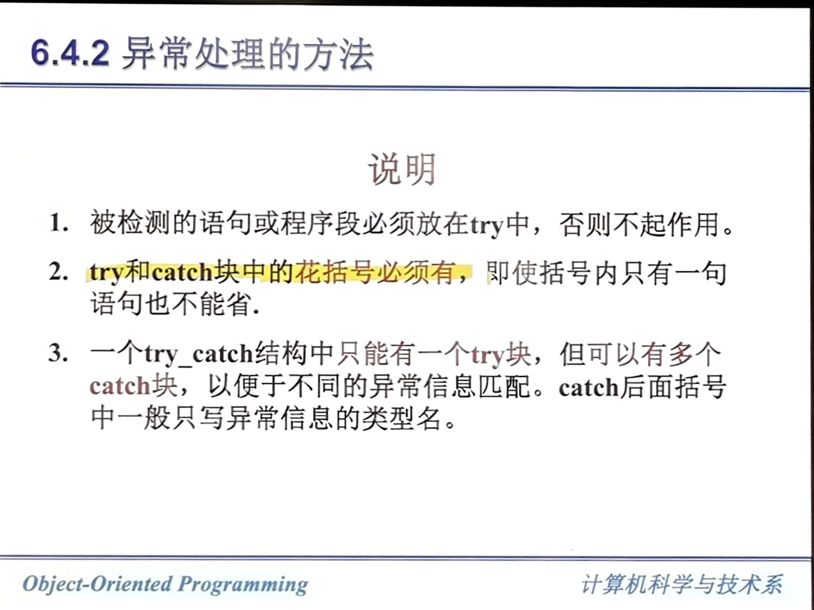
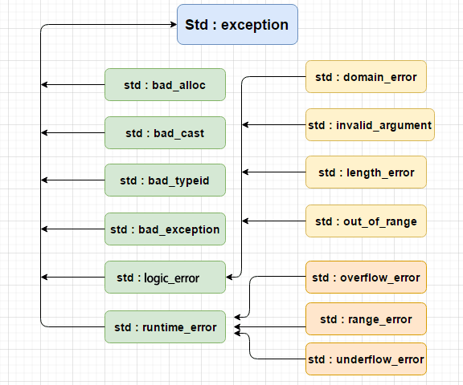

# 模板与异常
## 模板的概念
在 C++ 中可以通过重载函数使函数有同样的函数名，但必须为每个函数编写一组代码。  

``` cpp
int Max(int x, inty);
long Max(long x, long y);
double Max(double x, double y);
```

定义一个函数的模板，实现上面 3 个函数的功能。  
``` cpp
template <typename T> T Max(T x, T y)
{
    return (x > y) ? x : y;
}
```

模板是实现代码重用机制的一种工具。模板分为函数模板和类模板。  



## 函数模板与模板函数
T 为类型参数，可以取系统预定义的数据类型，又可以取用户自定义的类型。  
定义了虚拟的类型 T，

``` cpp
template <typename T> T Max(T x, T y)
{
    return (x > y) ? x : y;
}
```

下面这种写法也可以，但是不推荐。用上面的写法更好。  
``` cpp
template <class T> T Max(T x, T y)
{
    return (x > y) ? x : y;
}
```

实际调用时，函数会根据函数模板实例出一个函数。  



模板函数编译器会自动帮我们生成。  

``` cpp
template <typename T> T sum(T *array, int size = 0)
{
    T total = 0;
    for (int i = 0; i < size; i++)
        total += array[i];
    return total;
}

int main()
{
    int iArr[] = {1, 2, 3, 4, 5};
    double dArr[] = {1.1, 2.2, 3.3, 4.4, 5.5};

    std::cout << "int sum: " << sum(iArr, 5) << std::endl;
    std::cout << "double sum: " << sum(dArr, 5) << std::endl;

    return 0;
}
```

输出:
```
int sum: 15
double sum: 16.5
```

可以显式在调用时确定 template 的类型：  
``` cpp
template <typename T> T Max(T a, T b)
{
    return a > b ? a : b;
}

int main()
{
    std::cout << "Max(3, 5): " << Max<int>(3, 5) << std::endl;
    std::cout << "Max(3.14, 2.72): " << Max<double>(3, 2.72) << std::endl;

    return 0;
}
```

可以定义两个 typename:
``` cpp
template <typename T1, typename T2> T1 Max(T1 a, T2 b)
{
    return a > b ? a : b;
}

int main()
{
    std::cout << "Max(3, 5): " << Max(3, 5) << std::endl;
    std::cout << "Max(3.14, 2.72): " << Max(3.14, 2.72) << std::endl;
    std::cout << "Max(3, 2.72): " << Max(3, 2.72) << std::endl;

    return 0;
}
```

同一般函数，函数模板也可以重载。  

``` cpp
template <typename type>
type Max(type x, type y){
    return (x > y) ? x : y;
}

template <typename type>
type Max(type x, type y, type z){
    type t;
    t = (x > y) ? x : y;
    return (t > z ) ? t : z;
}
```

函数模板与同名的非模板函数可以重载。  

``` cpp
#include <iostream>
#include <cstring>

// 函数模板：适用于所有支持 > 运算符的类型
template <typename T> T Max(T x, T y)
{
    return (x > y) ? x : y;
}

// 非模板函数重载：专门处理 const char* 类型
// 当参数为 const char* 时，优先调用这个非模板版本（而不是模板版本）
const char* Max(const char* x, const char* y)
{
    return (std::strcmp(x, y) > 0) ? x : y;
}

int main()
{
    // 调用模板版本 —— Max<int>
    std::cout << "Max(3, 5) = " << Max(3, 5) << std::endl;

    // 调用模板版本 —— Max<double>
    std::cout << "Max(3.14, 2.72) = " << Max(3.14, 2.72) << std::endl;

    // 调用非模板版本 —— const char* 精确匹配，优先于模板
    std::cout << "Max(\"hello\", \"world\") = "
              << Max("hello", "world") << std::endl;

    return 0;
}
```

输出:
```
Max(3, 5) = 5
Max(3.14, 2.72) = 3.14
Max("hello", "world") = world
```

> 当函数模板和非模板函数同时匹配时，编译器优先选择非模板函数。




## 类模板和模板类
一个通用的类，允许用虚拟的类型来代表类中的某些类型。  
使用类模板定义对象时，根据实际需要将虚拟类型替换为具体类型，从而实现代码复用。

``` cpp
#include <iostream>

// 类模板：定义一个通用的 Pair 类
template <typename T1, typename T2>
class Pair
{
  public:
    Pair(T1 f, T2 s) : first(f), second(s) {}

    T1 getFirst() const { return first; }
    T2 getSecond() const { return second; }

template 
    void print() const
    {
        std::cout << "(" << first << ", " << second << ")" << std::endl;
    }

  private:
    T1 first;
    T2 second;
};

int main()
{
    // 实例化类模板：用具体类型替换虚拟类型
    Pair<int, double> p1(10, 3.14);
    Pair<std::string, int> p2("age", 25);

    p1.print();  // 输出: (10, 3.14)
    p2.print();  // 输出: (age, 25)

    return 0;
}
```


开头加了 `template <typename Type>`  


类模板的使用上将类模板实例化一个具体的类:
```cpp
类模板名 <实际的类型> 对象名;
```

例：
``` cpp
Stack<int> s1, s2;
```



模板类也可以传多个参。  
## 异常处理
错误分类：1. 编译时的错误、2. 运行时的错误。
运行过程中出现的错误统称为异常。传统异常的处理方法基本上是采取判断语句或分支语句来实现。  

C++ 在出现异常的时候会抛出异常，会传递给上一级调用函数来解决。逐级上传，如果到最高一层还无法处理就会触发 `abort()` 终止程序。  

这种处理方法使得异常的引发和处理机制分离。  
底层函数着重解决实际问题而不必过多的考虑对异常的处理，以减轻底层函数的负担。  

C++ 的异常处理机制是由分离、抛出、捕获 3 部分组成。  
1. `throw` 抛出
2. `try` 检查
3. `catch` 捕获

``` cpp
int Div(int x, int y)
{
    if (y == 0)
    {
        throw y; // 抛出异常，当除数为 0 时，语句 throw 抛出 int 型异常
    }
    return x/y;
}
```

try、catch 语句。  
``` cpp
try {
    被检查的复合语句
}
catch (异常类型声明 a){
 doing();
}

...

catch (异常类型声明 n)
{
    doing();
}
```





如果在 catch 子句中用三个点，表示任意类型。  

### C++ 标准异常



``` cpp
#include <iostream>
#include <new> // bad_alloc

int main() {
    try {
        // 尝试分配一块极大的内存，触发 bad_alloc
        int* p = new int[1000000000000LL]; // 约 400GB，几乎必然失败
    } catch (const std::bad_alloc& e) {
        std::cout << "捕获到异常: " << e.what() << std::endl;
    }
    return 0;
}
```
## 应用举例
