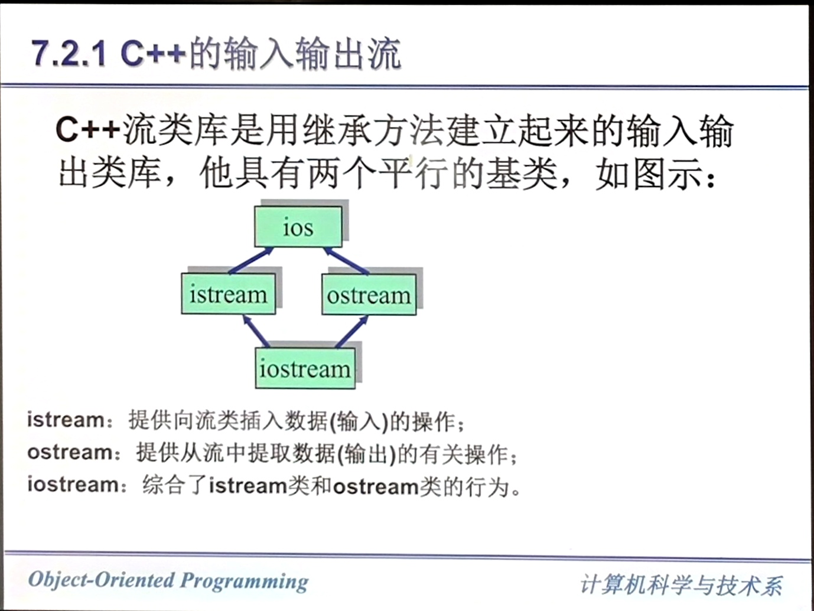
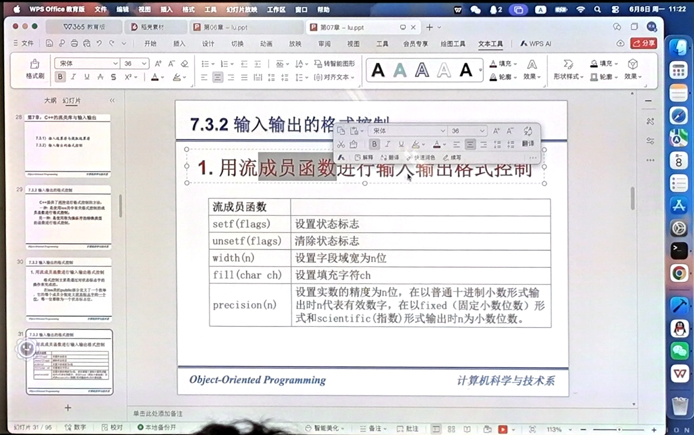
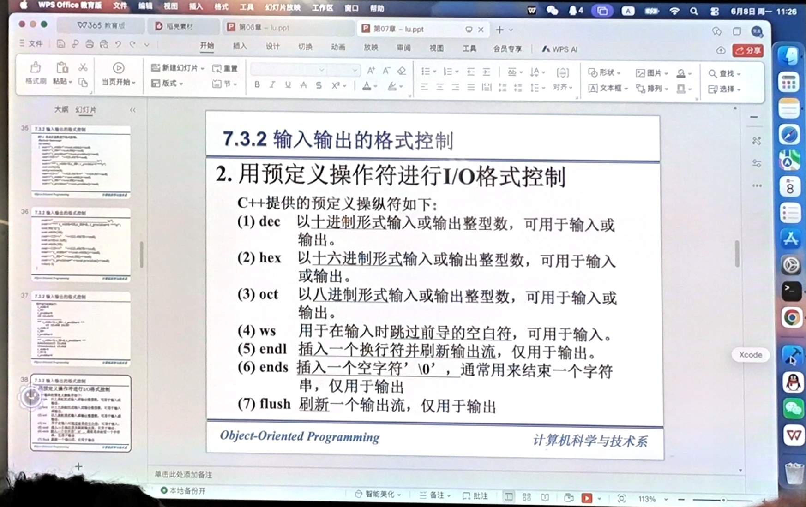
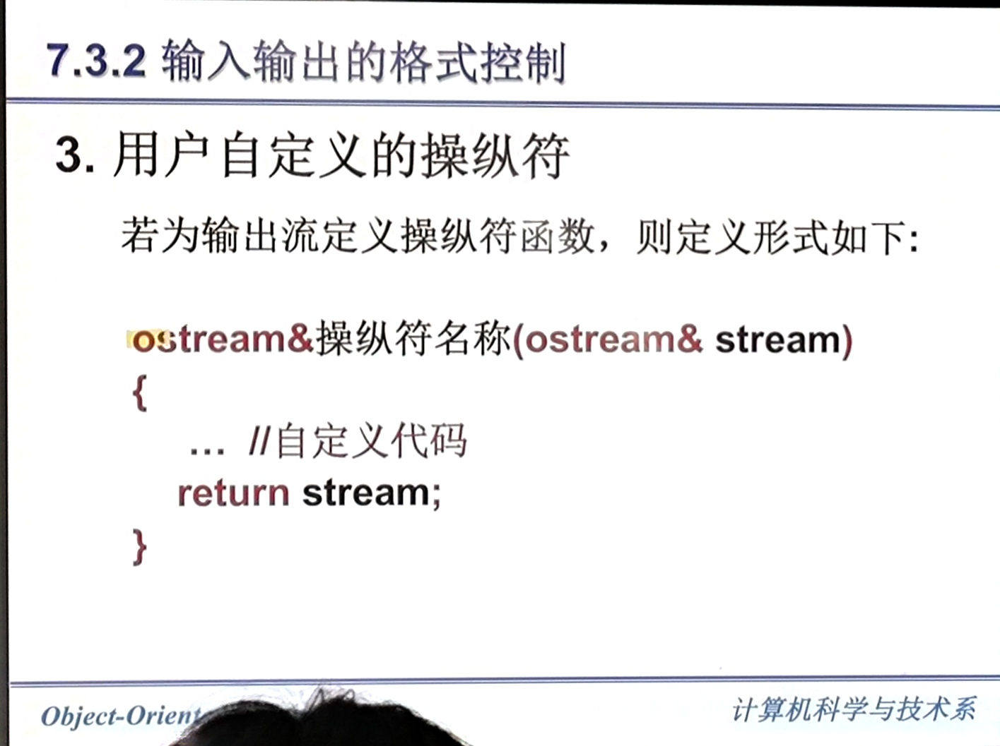
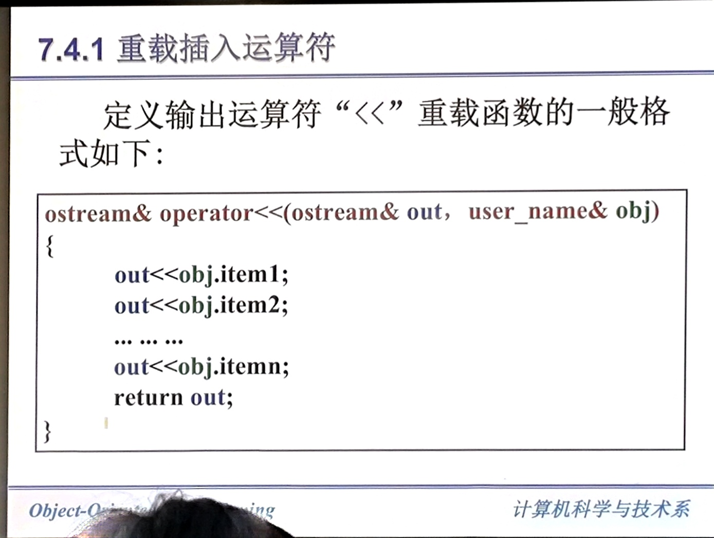
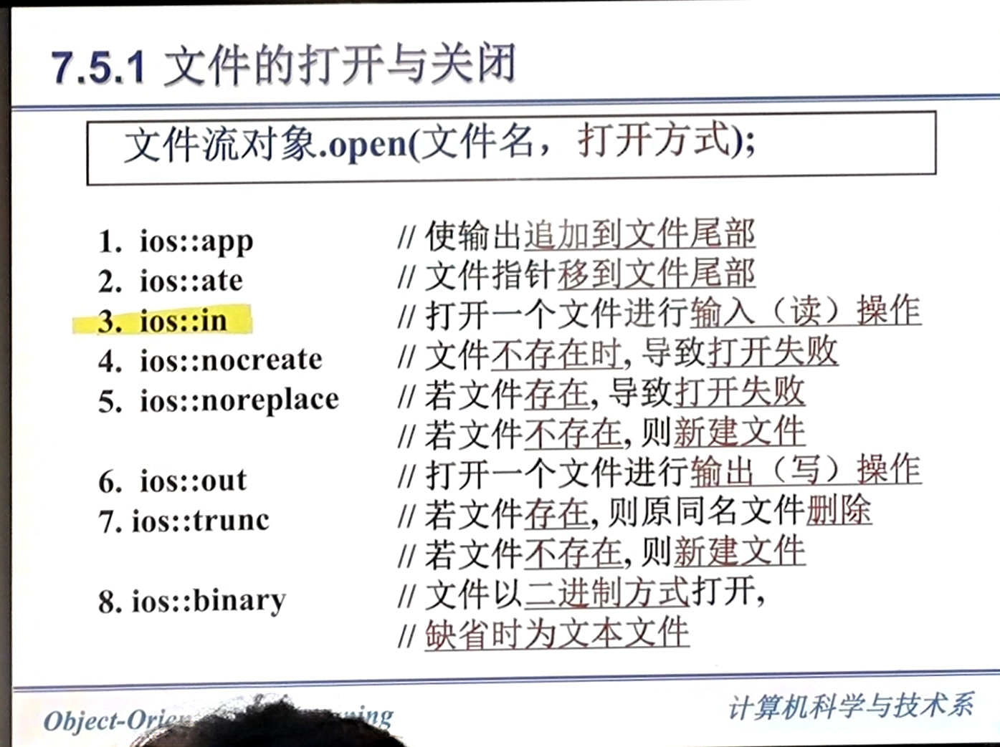

#  C++ 的类流类库与输入输出

## C++ 为何建立自己的输入输出系统
C++ 需要定义众多的自定义类型，但是 C 语言的输入输出系统不支持用户自定义类型。  

C++ 的类机制可以允许它建立一个可扩展的输入输出系统，可以用于用户自定义类型的数据。  

## C++ 流的概述
C++ 程序中，数据可以从键盘流入程序中，也可以从程序流向屏幕或磁盘文件，把数据的流动抽象为“流”。流实际上就是一个字节序列。  

C++ 中，流类是为输入输出提供的一组类。  
| 类名 | 说明 |
|------|------|
| `ios` | 流的基类，管理流的状态和格式化 |
| `istream` | 输入流类，支持数据的输入操作 |
| `ostream` | 输出流类，支持数据的输出操作 |
| `iostream` | 输入输出流类，继承自 `istream` 和 `ostream` |
| `ifstream` | 文件输入流类，用于从文件读取数据 |
| `ofstream` | 文件输出流类，用于向文件写入数据 |
| `fstream` | 文件输入输出流类，支持文件的读写操作 |




预定义流对象：

| 流对象 | 说明 |
|--------|------|
| `cin` | 标准输入流，关联键盘设备 |
| `cout` | 标准输出流，关联屏幕设备 |
| `cerr` | 标准错误流，无缓冲，直接输出到屏幕 |
| `clog` | 标准日志流，有缓冲，输出到屏幕 |

输入输出成员函数：
1. `cout.put(char c);`  
2. `cin.get(ch);`
3. `cin.getline(字符指针, 字符个数,终止标志字符);`  :w
4. `cin.ignore(n, 终止字符);` 跳过输入流中 n 个字符，默认为 1.或在遇到指定终止符时提前退出。  

## 预定义类型的输入输出
输入输出运算符：`>>`、`<<`。  
双目运算符。  
### 插入运算符 `<<`
```cpp
cin >> 变量; // 输入
cin.operator>>(变量);
```

### 提取运算符 `>>`  
``` cpp
cout << 常量或变量;  // 输出
cout.operator<<("This is a string.\n");
```

从输入的数据流中提取一些数据。  
在默认情况下，运算符 `>>` 将跳过空白符。然后读入后面与变量类型相对应的值。  
当输入字符串时，`>>` 跳过空白符，读入后面非空白符，直到遇到另一个空白符为止，并在后面添加上`\x00`。  

C++ 提供了两种进行格式控制的方法：
1. 使用 ios 类中有关格式控制的成员函数进行格式控制。  
2. 使用操纵符的特殊类型函数进行格式控制。  



操纵符使用示例：

```cpp
#include <iostream>
#include <iomanip>

int main() {
    // 设置输出宽度为10，右对齐，用*填充
    std::cout << std::setw(10) << std::setfill('*') << 42 << std::endl;
    // 输出: ********42

    // 设置精度为3位小数
    std::cout << std::fixed << std::setprecision(3) << 3.14159 << std::endl;
    // 输出: 3.142

    // 设置进制输出
    std::cout << std::hex << 255 << std::endl;  // 输出: ff
    std::cout << std::oct << 255 << std::endl;  // 输出: 377
    std::cout << std::dec << 255 << std::endl;  // 输出: 255

    // 左对齐
    std::cout << std::left << std::setw(10) << "Hello" << "World" << std::endl;
    // 输出: Hello     World

    return 0;
}
```





### 用户自定义类型的输入输出


第一个参数是流的对象，第二个是用户自定义类型的对象。  

提取运算符同理。  

## 文件的输入输出
C++ 文件是字节流或二进制流。这种文件成为流式文件。  
`ifstream` `ofstream` `fstream` 定义在 `fstream.h` 文件中。  

### 文件的打开与关闭  
建立流，定义流类的对象  
使用 open() 函数打开文件，也就是使某一文件与上面的某一流相联系。  



``` cpp
ofsteam of;
of.open("./1.txt", ios::out);
doing();
of.close();

ifstream if;
if.open("./1.txt", ios::in);
doing();
if.close();
```


### 文件的读写


